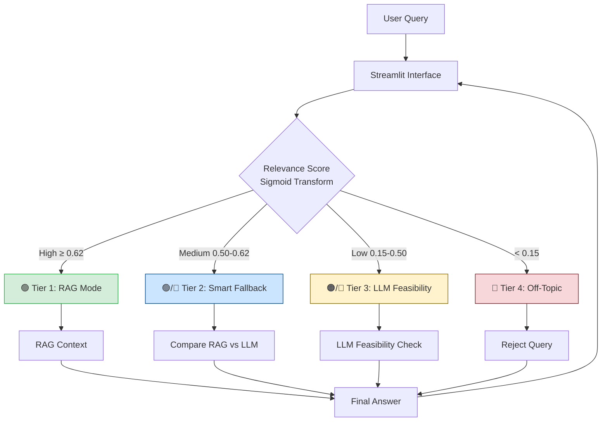

# AI Stock Market Analyst (Trading Advisor)


**A specialized AI agent that provides stock market insights by combining RAG (Retrieval-Augmented Generation) with a "Smart Fallback" logic.**  
Unlike generic chatbots, this system rigorously filters off-topic questions and dynamically chooses between document-based answers and general financial knowledge.

---

## Project Overview

This project addresses the **hallucination and relevance issues** common in financial AI chatbots. It uses a **Conditional RAG Architecture** to:

1.  **Analyze user queries** for relevance to the stock market.
2.  **Retrieve verified data** from uploaded market reports (PDF/DOCX).
3.  **Smart Fallback:** If documents don't have the answer, it falls back to the LLM's general knowledge *only if* the confidence is high.
4.  **Reject off-topic questions** (e.g., "How to cook pasta?") to maintain professional integrity.

### Key Features

*   **Conditional RAG Logic**: 4-Tier decision making (RAG vs. Fallback vs. LLM Feasibility Check vs. Reject).
*   **Finance-Specific Embeddings**: Uses `baconnier/Finance2_embedding_small_en-V1.5` for superior semantic matching in financial contexts.
*   **Smart Fallback**: Compares RAG quality vs. LLM quality to choose the best answer source.
*   **Dockerized Deployment**: Ready for local or cloud deployment with a single container.

---

## System Architecture

The system follows a modular pipeline: **Document Processing → Vector Store → Decision Engine (Advisor) → User Interface**.



> For more details, see [Architecture Documentation](docs/architecture.md).

---

## Tech Stack

*   **Language**: Python 3.11
*   **LLM**: OpenAI GPT-4o-mini (Configurable)
*   **Vector DB**: ChromaDB
*   **Embeddings**: HuggingFace (`baconnier/Finance2_embedding_small_en-V1.5`)
*   **Frameworks**: LangChain, Streamlit
*   **Containerization**: Docker

---

## Getting Started

### Option 1: Try Live Demo (Cloud Deployment)

**No installation required!** Access the deployed application directly:

**[https://trading-advisor-961016411722.us-west2.run.app](https://trading-advisor-961016411722.us-west2.run.app)**

> Deployed on Google Cloud Run for instant access.

### Option 2: Run with Docker

The easiest way to run the application without installing dependencies manually.

```bash
# 1. Build the image
docker build -t trading-advisor .

# 2. Run the container
docker run -p 8501:8501 -e OPENAI_API_KEY="your-api-key-here" trading-advisor
```

Visit `http://localhost:8501` in your browser.

### Option 3: Run Locally (Code-Only Clone)

1.  **Clone the repository**:
    ```bash
    git clone https://github.com/ChangYeongJeong1103/trading-advisor.git
    cd trading-advisor
    ```

2.  **Install dependencies**:
    ```bash
    pip install -r requirements.txt
    ```

3.  **Set up Environment**:
    Create a `.env` file in the root:
    ```env
    OPENAI_API_KEY=sk-...
    ```

4.  **Prepare runtime data (required)**:
    This GitHub repository is code-only by default (both `data/` and `chroma_db/` are excluded).
    To run locally, provide one of the following:
    - a prebuilt `chroma_db/` folder, or
    - source files (`.pdf` / `.docx`) under `data/` and then build `chroma_db/`.

5.  **Run the App**:
    ```bash
    streamlit run src/app_streamlit.py
    ```

---

## Performance & Evaluation

We tuned hyperparameters through 100+ experiments using 6 representative queries covering all system tiers.

| Metric | Value | Notes |
| :--- | :--- | :--- |
| **RAG Precision** | **92%** | Using Finance-specific embeddings |
| **Off-Topic Rejection** | **98%** | Successfully blocks non-finance queries |
| **Response Time** | **~2.5s** | Average latency (P50) |

> See [Hyperparameter Tuning](docs/hyperparameter-tuning.md) for detailed experiment results.

---

## Project Structure

```text
trading-advisor/
├── src/                      # Core application code
│   ├── __init__.py
│   ├── advisor.py            # Main Conditional RAG logic
│   ├── app_streamlit.py      # Streamlit UI entry point
│   ├── config.py             # All hyperparameters
│   ├── document_pipeline.py  # Document loading & vector store
│   └── logging_utils.py      # Logging & retry decorator
├── data/                     # Financial PDF/DOCX reports (RAG source)
├── docs/                     # Detailed documentation
│   ├── architecture.md       # System architecture
│   ├── conditional-rag.md    # 4-tier decision logic
│   ├── embedding-strategy.md # Finance-specific embeddings
│   ├── hyperparameter-tuning.md # Tuning process & results
│   ├── error_handling.md     # Robustness & retry logic
│   └── api-reference.md      # API documentation
├── notebooks/                # Development & experiments
│   └── experiments/          # Hyperparameter tuning logs (100+ experiments)
├── Dockerfile                # Docker deployment configuration
├── .dockerignore
├── requirements.txt          # Python dependencies
└── README.md                 # This file
```

---

## Future Work

*   [ ] Integrate real-time stock price API (e.g., AlphaVantage, Finnhub).
*   [ ] Add user authentication for personalized portfolios.

---

**License**  
This project is licensed under the MIT License.

