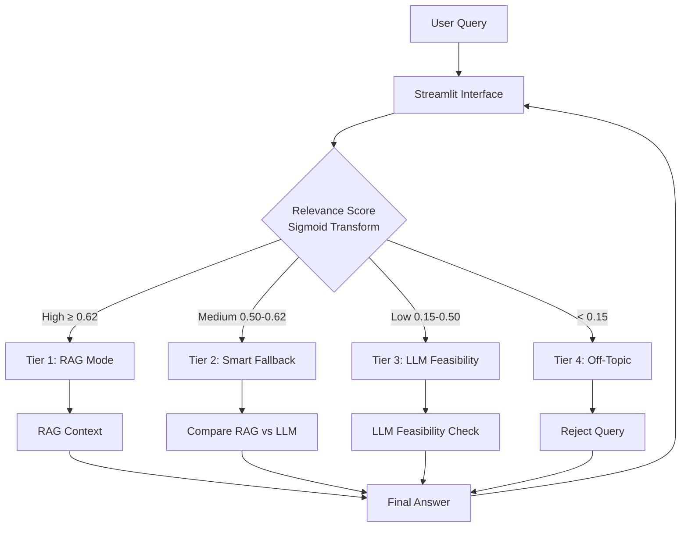

# Trading Advisor


This repository hosts **two cooperating systems** built on the same domain
(stock market intelligence). Both are independently deployable and share only
the repo root, secrets policy, and license.

| Version | Name | What it does | Runtime | Status |
|---|---|---|---|---|
| **v0** | **AI Stock Market Analyst** | Conditional RAG chatbot over weekly US-market PDF reports. Streamlit UI. | Cloud Run (Streamlit container) | Live |
| **v1** | **Cross-Market Anomaly Detection Daemon** | 24/7 watcher over CME futures, Polymarket, Hyperliquid, social X feed, and Trump Truth Social. Emits tiered alerts (Email / Telegram / public X feed) when several detectors fire in concert on the same symbol. | Cloud Run (always-on daemon) | Live |

Skip to [v0 — AI Stock Market Analyst](#v0--ai-stock-market-analyst) or
[v1 — Anomaly Detection Daemon](#v1--cross-market-anomaly-detection-daemon).

> **Live X feed (auto-posted EMERGENCY alerts from v1):**
> 👉 **[@Trading-advisor on X](https://x.com/MarketCaptureAI)**

---

# v0 — AI Stock Market Analyst

**A specialized AI agent that provides stock market insights by combining RAG
(Retrieval-Augmented Generation) with a "Smart Fallback" logic.**
Unlike generic chatbots, this system rigorously filters off-topic questions and
dynamically chooses between document-based answers and general financial
knowledge.

## v0.1  Project overview

This project addresses the **hallucination and relevance issues** common in
financial AI chatbots. It uses a **Conditional RAG Architecture** to:

1. **Analyze user queries** for relevance to the stock market.
2. **Retrieve verified data** from uploaded market reports (PDF/DOCX).
3. **Smart Fallback** — if documents don't have the answer, fall back to the
   LLM's general knowledge *only if* confidence is high.
4. **Reject off-topic questions** (e.g., "How to cook pasta?") to maintain
   professional integrity.

### Key features

- **Conditional RAG logic** — 4-tier decision making (RAG vs. Fallback vs. LLM
  Feasibility Check vs. Reject).
- **Finance-specific embeddings** — `baconnier/Finance2_embedding_small_en-V1.5`
  for superior semantic matching in financial contexts.
- **Smart fallback** — compares RAG quality vs. LLM quality to choose the best
  answer source.
- **Dockerized deployment** — ready for local or cloud deployment with a single
  container.

## v0.2  System architecture

The system follows a modular pipeline:
**Document Processing → Vector Store → Decision Engine (Advisor) → User Interface.**



> For more details, see [`docs/v0-market_summary/architecture.md`](docs/v0-market_summary/architecture.md).

## v0.3  Tech stack

- **Language**: Python 3.11
- **LLM**: OpenAI GPT-5-mini (configurable)
- **Vector DB**: ChromaDB
- **Embeddings**: HuggingFace (`baconnier/Finance2_embedding_small_en-V1.5`)
- **Frameworks**: LangChain, Streamlit
- **Containerization**: Docker

## v0.4  Getting started

### Option 1 — Try the live demo

**No installation required.** Access the deployed application directly:

**[https://trading-advisor-961016411722.us-west2.run.app](https://trading-advisor-961016411722.us-west2.run.app)**

> Deployed on Google Cloud Run for instant access.

### Option 2 — Run with Docker

```bash
# 1. Build the image (build context = repo root)
docker build -f Dockerfile.market_summary -t market-summary .

# 2. Run the container with your OpenAI key
docker run -p 8501:8501 -e OPENAI_API_KEY="sk-..." market-summary
```

Visit `http://localhost:8501`.

### Option 3 — Run locally (code-only clone)

```bash
git clone https://github.com/ChangYeongJeong1103/trading-advisor.git
cd trading-advisor

pip install -r requirements_v0-market_summary.txt

# .env in repo root — copy the template and fill in your OpenAI key
cp .env.example .env
# then edit .env and set OPENAI_API_KEY=sk-...

# v0 code imports siblings as `from config import ...`, so run from inside src/market_summary/.
cd src/market_summary
streamlit run app_streamlit.py
```

> `.env.example` documents every variable used by both v0 and v1. For v0 you
> only need `OPENAI_API_KEY` — leave the v1 block (SMTP, Telegram, Databento,
> X API, …) empty.

**Prepare runtime data (required).** This repo is code-only by default
(`chroma_db/` and large generated artifacts are excluded). To run locally,
provide one of the following:

- a prebuilt `chroma_db/` folder under `src/market_summary/`, or
- source PDFs under `data/market_summary/` and let the pipeline build
  `chroma_db/` on first run.

## v0.5  Performance & evaluation

Hyperparameters were tuned through 100+ experiments over 6 representative
queries covering all system tiers.

| Metric | Value | Notes |
|---|---|---|
| **RAG Precision** | **92%** | Using Finance-specific embeddings |
| **Off-Topic Rejection** | **98%** | Successfully blocks non-finance queries |
| **Response Time** | **~2.5 s** | Average latency (P50) |

> See [`docs/v0-market_summary/hyperparameter-tuning.md`](docs/v0-market_summary/hyperparameter-tuning.md)
> for detailed experiment results.

---

# v1 — Cross-Market Anomaly Detection Daemon

**A 24/7 anomaly detection system that watches CME futures, prediction markets,
perpetual swaps, social signals, and the Trump Truth Social feed — and
automatically alerts via Email, Telegram, and a public X (Twitter) feed when it
sees patterns historically associated with informed-flow / pre-event
accumulation.**

EMERGENCY-tier signals (multi-detector concurrency + LLM-confirmed
insider-pattern match) are posted in real time as a 3-tweet thread:

1. Detectors that fired (with formulas + values) and a one-line analysis.
2. *Insider view* — a 3-bullet LLM assessment of how closely it matches
   historical insider events.
3. *Trader's view* — a 3-bullet LLM take on what the flow likely means and how
   to react prudently.

## v1.1  What it does

The system continuously ingests **five independent data streams**, computes
channel-specific anomaly features, and emits a tiered alert when several
detectors fire in concert on the same symbol. The same alert flows to:

| Channel | Latency | Audience | Tiers delivered |
|---|---|---|---|
| **Email** (SMTP) | seconds | personal inbox / operators | RISK_OFF + EMERGENCY |
| **Telegram** (Bot API) | seconds | personal phone | EMERGENCY |
| **X / Twitter** (API v2) | seconds | public ([@Trading-advisor](https://x.com/MarketCaptureAI)) | EMERGENCY only |

The X auto-posting feature is the headline operational capability — anyone can
follow the public X account and see the same anomaly signals (de-identified,
no operator IDs) the moment they fire.

## v1.2  Data sources & channels

| # | Channel | Source | What it watches |
|---|---|---|---|
| 1 | `cme` | Databento (live MDP3 trades) → GCS Parquet | CL (WTI), BZ (Brent), ES (S&P 500), GC (Gold). 1m / 2m / 5m rolling buckets, dual-trigger on max tier. |
| 2 | `polymarket` | Polymarket public API | High-impact political / macro markets (e.g., Iran ceasefire, China tariff escalation). |
| 3 | `hyperliquid` | Hyperliquid REST + WebSocket | Top perp coins (BTC, ETH, SOL …). New-wallet whale entries + cluster betting. |
| 4 | `x` (social) | LLM-classified post stream | Pre-event narrative repetition across multiple verified accounts (matched against a historical case library). |
| 5 | `truth_social` | Trump Truth Social public posts (5-min poll) | LLM (`gpt-5.4`) market-impact scoring of each new post against a 22-event Phase 1–6 reference DB (tariff / Iran / China / Fed / Russia-Ukraine policy moves). |

Symbol → friendly name mapping (used in Email / Telegram subject lines):

```
BZ → Brent Crude Oil      CL → WTI Crude Oil
ES → S&P 500 Futures      NQ → Nasdaq-100 Futures
GC → Gold Futures         SI → Silver Futures
ZN → 10-Year T-Note       ZB → 30-Year T-Bond
```

X-channel friendly outputs strip ticker codes entirely (e.g., `BZQ5` →
`Brent Crude Oil`) so external readers don't need to decode contract codes.
Truth Social signals use a `topic_slug` (e.g., `rare_earth_export_ban`,
`mexico_canada_tariff`) for the same purpose.

## v1.3  Detectors (per channel)

A signal becomes `EMERGENCY` only when **3 or more detectors fire concurrently**
(`RISK_OFF` = 2, `WATCH` = 1). Channel 5 is the exception — it uses a single
LLM score with explicit thresholds (see below).

### CME (`channels/cme/`)
- `vol_burst_v2` — same-minute time-of-day Z-score (`VOL_TOD_Z`) plus rolling
  vol_z fallback.
- `price_jump_v1` — 1m / 5m percentage move (`PRICE_JUMP_PCT_1M`).
- `directional_v1` — buy/sell imbalance × consecutive-side run length
  (`DIR_IMB`, `RUN`).
- Dual-trigger: 1-min and 2-min buckets evaluated independently; max tier wins.

### Polymarket (`channels/polymarket/`)
- `vol_burst_v2`, `directional_v1` (shared logic).
- `wallet_concentration_v1` — top-N wallet share + same-direction ratio (`WC=…`).
- `WC_BOOST` / `WC_DAMP_RETAIL` — concentration meta-rules.

### Hyperliquid (`channels/hyperliquid/`)
- `vol_z_v1` — rolling notional Z-score.
- `insider_v1` — composite condition counter
  (`INSIDER cond=N/4 OIΔ=… fund=… impact_ratio=…`) over open-interest, funding,
  price-impact, and stealth.
- `new_whale_v1` — fresh wallets (<24 h old) with large 5-min cumulative flow.
- `cluster_v1` — multiple fresh wallets entering the same coin/side
  simultaneously.
- `panic_filter_v1` — downgrades panic-flow false positives.

### X (`channels/x/`)
- LLM classifier matches incoming posts against a curated historical case
  library (`X_ACCOUNTS`, `X_MAGNITUDE`, `X_WEIGHT`, `matched:<case>`,
  `pre_event_alert`).

### Truth Social (`channels/truth_social/`)
- 5-minute poller against Trump's public Truth Social timeline.
- LLM scorer (`gpt-5.4`, JSON mode) compares each new post against a 22-event
  reference DB stored in `data/anomaly_detection/truthsocial/`. Outputs
  `market_impact_score` (0–10), `topic_slug`, `category`, `key_tickers`, and a
  separate `insider_concern_score` (0–10) capturing potential information
  asymmetry.
- Tier thresholds:
  - **EMERGENCY** — `impact_score ≥ 9` (S&P ±3 %+ expected; Liberation-Day class).
  - **RISK_OFF** — `impact_score 7–8` (S&P ±1–3 %; tariff or Iran/China policy).
  - **WATCH** — `impact_score 5–6` (suppressed from email; counted only).

## v1.4  Alert pipeline

```
┌────────────────────────────────────────────────────────────────────────┐
│                       Cloud Run (anomaly-daemon)                       │
│                                                                        │
│   Databento  ─► CME channel ──┐                                        │
│   Polymarket ─► Poly channel ─┤                                        │
│   Hyperliquid─► HL channel   ─┼──► ChannelSignal  ──► ChannelCooldown  │
│   Social X   ─► X channel    ─┤    (tier, score,       (24h per        │
│   Truth Social─►TS channel   ─┘     dir, reason,        channel /      │
│                                     fired_detectors)    symbol / tier) │
│                                            │                           │
│                                            ▼                           │
│                                 ChannelAlertDispatcher                 │
│                                            │                           │
│                ┌───────────────────────────┼───────────────────────┐   │
│                ▼                           ▼                       ▼   │
│           SMTP send                 Telegram send         X auto-post  │
│         (email + plot)             (caption + plot)       (3-tweet     │
│                                                            thread,     │
│                                                            EMERGENCY)  │
│                                                                        │
│   LLMAlertAssessor (GPT-5.4) — runs only on EMERGENCY:                 │
│     · scores 0–10 vs historical insider event library                  │
│     · produces 3–5 "Insider view" + 3 "Trader's view" bullets          │
│     · feeds the same content to Email, Telegram, and X.                │
└────────────────────────────────────────────────────────────────────────┘
```

### Cooldown v2

A symbol that fires `EMERGENCY` is silent for 24 hours **per channel**. Two
carve-outs:
- **Tier escalation** — if a `WATCH` becomes `EMERGENCY` mid-cooldown, the
  higher tier is allowed through.
- **Calendar filter (P12-A)** — alerts inside a known scheduled macro window
  (FOMC, CPI, OPEC, EIA, NFP) are tagged `SCHEDULED_<event>` and pass through
  for `EMERGENCY` only; lower tiers are suppressed to cut false positives
  around release time.

## v1.5  Alert content (the part posted to X)

Every `EMERGENCY` produces an LLM-assessed package shared by all three
delivery channels:

```
Header:    CME | Brent Crude Oil | UP 0.92
Detectors: - Volume vs same-minute baseline = 4.2σ (n=180)
           - 1m price change = +1.30%
           - Trade flow imbalance = +0.85 (run = 11)
Analysis:  volume burst + price jump + one-way flow.
Imbalance: +1=all buys, 0=balanced, −1=all sells.

Insider view (7/10 suspicious)
- Volume 4.2σ above same-minute baseline — echoes the 4/21 BZ pre-OPEC profile.
- +0.85 directional imbalance with 11 same-side trades suggests one concentrated buyer.
- +1.30% in 1 minute on Brent with no macro release is unusual for retail flow.

Trader's view
- Brent front-month breaking out on burst volume — short-term skew is up.
- Short oil exposure? Consider trimming or hedging until the move confirms.
- Wait for a 5-minute close above the burst high before chasing.
```

On X this becomes a 3-tweet thread. On Email / Telegram the same content is
rendered as structured rows (with a `fired_detectors` audit row, an inline
1-hour and 6-hour timeline plot, and the user's local PT clock).

## v1.6  Tech stack & deployment

- **Language**: Python 3.11.
- **Runtime**: Google Cloud Run (us-west2), 1 instance, always-on.
- **Storage**: Google Cloud Storage (CME trade Parquet), in-memory rolling
  buffers for everything else.
- **Secrets**: Google Secret Manager (`OPENAI_API_KEY`, `DATABENTO_API_KEY`,
  X API OAuth1 keys, SMTP password, Telegram bot token).
- **External APIs**: Databento, Polymarket, Hyperliquid, X v2, OpenAI, Truth
  Social (public), SMTP (Gmail), Telegram Bot.
- **Dependencies**: see `requirements_v1-anomaly_detection.txt`.
- **Environment variables**: see [`.env.example`](.env.example) for the full
  list — SMTP credentials, Telegram bot, Databento, X API OAuth1 keys, runtime
  toggles (`ENABLE_X_AUTO_POST`, `X_POST_DRY_RUN`, …). For Cloud Run, the same
  keys are mounted from Google Secret Manager.
- **Build**: `Dockerfile.anomaly_detection` (multi-stage, non-root, Python 3.11
  slim base).
- **Deployment**: idempotent Cloud Run deploy script (uses `--update-env-vars`
  / `--update-secrets` so existing config is preserved between revisions).

Health endpoint (private; requires GCP identity token):

```bash
TOKEN=$(gcloud auth print-identity-token)
curl -H "Authorization: Bearer $TOKEN" \
  https://anomaly-daemon-961016411722.us-west2.run.app/health
# → {"ok": true, "uptime_s": ..., "cycles_run": ...}
```

## v1.7  X auto-post — operational notes

- **Authentication** — OAuth 1.0a (Consumer key/secret + Access token/secret
  with **Read & Write** permissions) stored in Secret Manager.
- **Rate-limit posture** — only `EMERGENCY` posts. Per-(channel × symbol) 24h
  cooldown means the daemon almost never bursts more than a handful of tweets
  per day.
- **Spam-filter compliance** — tweet content is intentionally trimmed of
  emoji-stuffing and tier labels (`🚨 EMERGENCY` etc.), uses plain `-`
  bullets, and keeps the lead tweet under 280 chars to avoid newer-account
  flag patterns.
- **Failure mode** — best-effort. An X API failure is logged and counted in
  `dispatcher.stats.x_post_errors` but does not block Email / Telegram
  dispatch.
- **Disable switch** — `ENABLE_X_AUTO_POST=false` at deploy time toggles
  posting off entirely. `X_POST_DRY_RUN=true` renders the thread but skips
  the API call (useful for local iteration).

## v1.8  Acknowledgements & calibration

The detector thresholds were calibrated against historical insider events
(3/23 Iran strike pause, 4/17 Hormuz open, 4/21 Trump-Iran fractured, 4/9
Liberation Day, 10/10 China tariff 100, 1/3 Maduro arrest, 2/28 Iran first
strike) using minute-level Databento trade data. The tier rule (1 / 2 / 3+
concurrent detectors → WATCH / RISK_OFF / EMERGENCY) emerged from that
calibration.

LLM assessments use a static prompt with a curated historical case library
kept in [`data/anomaly_detection/historical_events/`](data/anomaly_detection/historical_events/);
the Truth Social channel additionally uses a 22-event reference DB in
[`data/anomaly_detection/truthsocial/`](data/anomaly_detection/truthsocial/).
The prompt is cache-friendly and the assessor lazily initializes.

---

# Project structure

```text
trading-advisor/
├── README.md                              ← this file (v0 + v1 combined)
├── LICENSE                                ← MIT
├── Dockerfile.market_summary              ← v0 Streamlit image
├── Dockerfile.anomaly_detection           ← v1 daemon image (multi-stage)
├── cloudbuild.anomaly_detection.yaml      ← Cloud Build config for v1
├── requirements_v0-market_summary.txt     ← v0 deps (Streamlit + LangChain)
├── requirements_v1-anomaly_detection.txt  ← v1 deps (Databento, OpenAI, …)
├── config/                                ← v1 runtime config
│   ├── watchlist.yaml                     ← Polymarket / HL / CME tickers
│   ├── x_few_shot.yaml                    ← X channel LLM examples
│   └── x_keywords.yaml                    ← X channel keyword priors
├── docs/
│   ├── v0-market_summary/                 ← RAG architecture + tuning
│   │   ├── architecture.md
│   │   ├── api-reference.md
│   │   ├── conditional-rag.md
│   │   ├── embedding-strategy.md
│   │   ├── hyperparameter-tuning.md
│   │   └── error_handling.md
│   └── v1-anomaly_detection/              ← daemon design + ops
│       ├── anomaly-architecture.md
│       ├── anomaly-detection-math.md
│       ├── anomaly-upgrade-plan.md
│       ├── detection-design.md
│       ├── polymarket-replay.md
│       ├── replay-framework.md
│       ├── cloud-run-deploy.md
│       └── operations-monitoring.md
├── notebooks/                             ← v0 hyperparameter experiments
├── screenshoot/                           ← v0 demo screenshots
├── src/
│   ├── market_summary/                    ← v0
│   │   ├── __init__.py
│   │   ├── advisor.py                     ← Conditional RAG decision logic
│   │   ├── app_streamlit.py               ← Streamlit UI entry point
│   │   ├── config.py                      ← v0 hyperparameters
│   │   ├── document_pipeline.py           ← PDF/DOCX → vector store
│   │   └── logging_utils.py
│   └── anomaly_detection/                 ← v1
│       ├── core/                          ← Pydantic schemas, config loader
│       ├── channels/                      ← per-source ingest + detectors
│       │   ├── cme/                       ← Databento streamer + insider scan
│       │   ├── polymarket/                ← API poller + wallet attribution
│       │   ├── hyperliquid/               ← WS+REST + fresh-wallet store
│       │   ├── x/                         ← LLM social classifier
│       │   └── truth_social/              ← Trump TS poller + LLM scorer
│       ├── alerts/                        ← cross-channel routing + delivery
│       │   ├── channel_dispatcher.py
│       │   ├── cooldown.py
│       │   ├── llm_assessor.py
│       │   ├── x_publisher.py             ← X API v2 OAuth1 thread poster
│       │   └── renderer/                  ← email / telegram / x renderers
│       ├── calendar/                      ← scheduled macro release calendar
│       ├── replay/                        ← backtest framework
│       ├── monitoring/                    ← health endpoints, metrics
│       ├── storage/                       ← GCS / local parquet helpers
│       └── entrypoints/
│           └── anomaly_daemon.py          ← Cloud Run aiohttp service entry
├── assets/
│   └── anomaly/
│       └── channel_logos/                 ← inline brand logos (email)
└── data/
    ├── market_summary/                    ← v0 source PDFs (RAG)
    └── anomaly_detection/                 ← v1 reference DBs (tracked)
        ├── historical_events/             ← Channel 1–3 insider event library
        ├── truthsocial/                   ← Channel 5 Trump TS reference DB
        ├── polymarket_baseline/           ← market activity baseline
        └── hl_wallet/                     ← Hyperliquid wallet score baseline
```

Runtime artifacts (raw Databento ticks, replay outputs, chroma_db, alert
previews, etc.) are excluded by `.gitignore`. See it for the full list.

---

# Future work

**v0:**
- [ ] Integrate real-time stock price APIs (AlphaVantage, Finnhub, …) and
      broaden the ingestion to multiple news sources (Reuters, Bloomberg,
      Politico, FT) plus macro feeds (FRED, BEA, BLS, OPEC, IEA) so the
      advisor reasons over both price action *and* the surrounding narrative.
- [ ] Add user authentication for personalized portfolios.

**v1:**
- [ ] **Interactive post-detection discussion** — once an EMERGENCY fires,
      let the operator continue the conversation with the LLM assessor
      directly in the alert thread (follow-up questions, "what if" scenarios,
      counter-evidence, deeper historical comparisons) instead of getting a
      one-shot 3-bullet view.
- [ ] Public dashboard / event timeline page (Streamlit or Next.js) showing
      the last N EMERGENCY signals.
- [ ] Backtest report generator over the full historical event library
      (currently `src/anomaly_detection/replay/` only).
- [ ] Per-detector precision / recall tracking from the weekly review log.
- [ ] "Follow on X" badge once Channel 5 cadence has stabilized.

---

# License

This project is licensed under the MIT License — see [`LICENSE`](LICENSE).

*Live alerts → [@Trading-advisor on X](https://x.com/MarketCaptureAI)*
