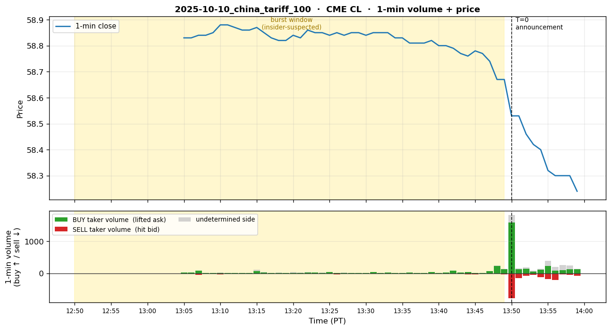
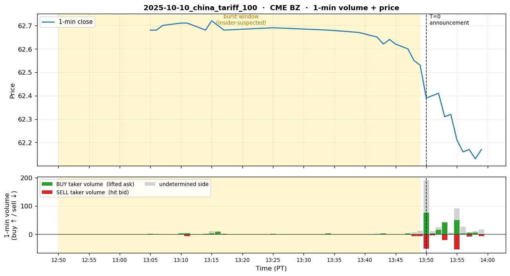
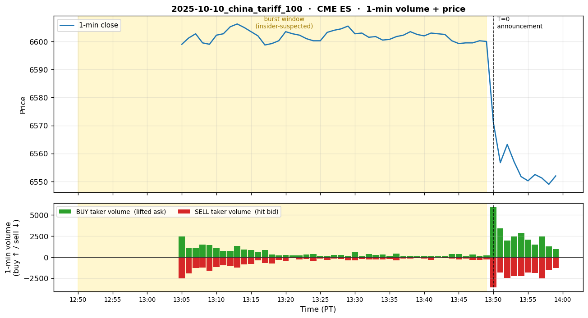
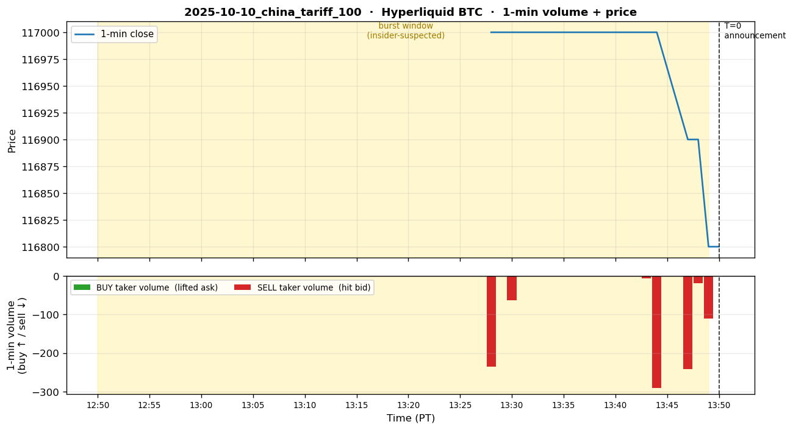

# 2025-10-10 — Trump China 100% Tariff Announcement

## 1. Event summary

| Field                | Value                                                                                  |
|----------------------|----------------------------------------------------------------------------------------|
| Announcement time    | 2025-10-10 20:50 UTC (1:50 PM PT) — Trump Truth Social post                             |
| Market impact        | BTC -15%, ETH -21% intraday. **Largest crypto liquidation in history $19.1B**                         |
| INSIDER likelihood   | **Extremely high** — last short add 1 minute before announcement                                            |
| Pre-event window     | 30 min ~ 1 day before announcement. Started 10/9 09:39 PT, final short 13:49 PT (announcement -1min)         |

## 2. Pre-event suspicious activity

- **When (T-window)**:
  - **T-28h 11min** (10/9 09:39 PT): first position opened.
  - **T-26h** ~ **T-3h**: gradual short accumulation — $110M+ entered.
  - **T-1min** (10/10 13:49 PT): final short added — ultimately ~$1.1B notable
    notional exposure.
- **Platform**: Hyperliquid (perpetual futures).
- **Direction**: Large BTC + ETH short (-).
- **Account pattern**: Suspected single individual, small number of accounts. Lookonchain analysis
  named the main wallet a "Bitcoin OG."
- **Profit**: +$160M ~ +$200M (single day).
- **Timing precision**: 1 minute — near-perfect timing.

## 3. Per-channel expected detector behavior

### 3.1 Channel 1 — Polymarket

- **State**: SILENT or very weak.
- **Reason**: Unclear whether an active market like "Trump tariff on China by Oct 2025?" existed on
  Polymarket. Even if it did, a trader would unlikely rely on Polymarket's low liquidity in a 30-min
  to 1-day window (Hyperliquid 5x leverage is far more capital-efficient).
- **Expected detector firing**: If a related market existed, a minor vol_burst is possible,
  but unlikely at EMERGENCY level.
- **Conclusion**: NORMAL ~ WATCH (verification needed).

### 3.2 Channel 2 — Hyperliquid (PRIMARY)

- **State**: **EMERGENCY target**. The biggest win candidate for our system.
- **Detector simulation (T-28h ~ T+0)** — what should fire if our detector were applied to the
  BTC/ETH perpetual OI time series. Key variable: size of the first position (per-timing detailed
  accumulation reconstruction in P10.2 via wallet tx).
  - **`oi_z_v1`** (BTC perpetual OI z-score, 5-min window):
    - **If the first position came in large (e.g., $50M+) at once**:
      - T-28h: vol first burst → z immediately reaches 4+ → **direct WATCH or RISK_OFF**
      - T-26h ~ T-22h: subsequent adds → cumulative z → **RISK_OFF** (user's expected scenario)
      - T-22h ~ T-1h: plateau, sticky window holds RISK_OFF
      - T-1min: final burst → **EMERGENCY**
    - **If accumulation was gradual (each add small)**:
      - T-28h: NORMAL (1 add falls within baseline)
      - T-12h: WATCH (cumulative OI outlier vs baseline)
      - T-3h: RISK_OFF (cumulative OI + cluster combined)
      - T-1min: EMERGENCY (final burst)
  - **`new_whale_v1`** (fresh wallet large position):
    - T-28h: When the first position starts, check whether the wallet is "new." Lookonchain reported
      "Bitcoin OG" (dormant then reactivated) → if our detector's dormancy threshold is appropriate,
      fires as "reactivated wallet." RISK_OFF possible.
  - **`cluster_v1`** (related wallet clustering):
    - Suspected single individual with a small number of accounts → cluster_strong → RISK_OFF assured.
  - **`panic_filter_v1`** (post-fact panic-trade filter):
    - Right after T+0, general retail panic shorts → panic_filter fires and downgrades the general
      retail signal. Insider wallet signal already fired before the panic, so unaffected.
- **Target tier timeline (aggressive — assuming the first position is large)**:
  - **T-28h** (first position opens): WATCH or direct RISK_OFF
  - **T-26h ~ T-22h**: **RISK_OFF** (oi_z + new_whale + cluster simultaneously) ← user-described
    "RISK_OFF from 22h before" scenario
  - T-12h ~ T-3h: RISK_OFF held (sticky window or continuous adds)
  - T-1h: RISK_OFF
  - **T-1min**: **EMERGENCY** (final burst)
  - T+0: EMERGENCY (announcement → price jump confirms)
- **P10.2 verification needed**:
  - Distribution of add sizes in the first 24h (large at once / gradual) → which scenario fits.
  - Whether new_whale_v1's dormancy threshold (default ?) catches reactivated wallets like the
    "Bitcoin OG."
- **Conclusion**: Hyperliquid is the clear primary. If the first position was large, **RISK_OFF emit
  22–27 hours before announcement**, **EMERGENCY 1 minute before**. If this scenario is confirmed by
  the real data, it **precisely achieves trading-advisor goal #1** — the user gets nearly a day's
  pre-warning.

### 3.3 Channel 3 — CME

- **State**: Not caught manually by the user, but **detector simulation is valuable**.
  The tariff announcement has large impact on the US equity market (tech-heavy S&P 100% China
  supply-chain exposure) — someone may have shorted ES / put-hedged ahead of time.
- **Detector simulation targets (all symbols)**:
  - **`vol_z_v1` (CME BTC futures)**:
    - T-1min ~ T+0: HL final burst spillover possible to CME BTC futures.
      z ~3–5 → WATCH/RISK_OFF.
    - Also check for sporadic spikes during the 24h pre-event window.
  - **`vol_z_v1` (CME ES)** — **may have been missed in user manual → catching with our detector
    would be a big find**:
    - At time T-X (X=?), if there was hedging flow in ES or SPY put options,
      ES 1-min volume z ≥ 3 spike. Verify in P10.2.
    - **If detected**: HL primary + ES secondary corroboration → boost rule fires.
  - **`vol_z_v1` (CME CL/BZ)**: China tariffs imply oil-demand concerns → minor spillover.
    Weak signal possible.
  - **`price_jump_v1` (all symbols)**: Right after T+0 all large jumps (S&P sharp drop, BTC
    sharp drop) → EMERGENCY post-fact confirmation.
- **Conclusion (tentative)**: BTC futures stay silent until T-1min → WATCH on T-1min spillover.
  ES pre-event signal depends on P10.2 verification results. If a strong signal is found in ES,
  this case's detection value rises further (especially valuable if ES is an asset the user
  trades aside from HL).

### 3.4 Channel 4 — X (Twitter)

- **State**: **The sole cross-channel pre-event corroboration source**.
- **Confirmed X post**:
  - **Lookonchain status `1976330420917764535`** — 2025-10-09 16:54 UTC = 09:54
    AM PT. About **28 hours before** the announcement (10/10 20:50 UTC). Publicly noted that "Bitcoin OG
    deposited 80M USDC to Hyperliquid to open shorts."
- **Expected detector firing**:
  - `Stage1Filter`: ticker_match (`BTC`, `Hyperliquid`), case_match
    (`hyperliquid`, `bitcoin og`, `5x leverage`), common_match (`short`,
    `deposited`, `suspicious timing`), regex_match (`usd_amount`,
    `leverage_multiplier`). Score ~1.4+ (after account_mult 1.20) → **Stage1
    PASS**.
  - `LLMClassifier`: matched_case = `2025.10.10_hyperliquid_china_tariff`,
    confidence ~0.85+, BTC SELL, **is_pre_event=True**, tier = **RISK_OFF or
    EMERGENCY**.
- **Validation**: Confirmed in our X channel live test that with a similar fabricated post,
  the LLM correctly identifies the matched_case (`scripts/smoke_x_channel_live.py`).
- **Conclusion**: X channel can emit a RISK_OFF or EMERGENCY signal **28 hours before** the
  announcement. Even faster lead-time advantage than the Hyperliquid channel. **This event is the
  strongest justification case for the X channel**.

## 4. Expected system_state timeline

```
T-28h    | EMERGENCY  (X Lookonchain post → LLM EMERGENCY)
                                                         per_channel: pm=N, hl=N, cme=N, x=E
T-28h    | RISK_OFF/EMERGENCY  (HL first position large → immediate RISK_OFF; X sticky held)
                                                         per_channel: pm=N, hl=R, cme=N, x=E
T-22h    | RISK_OFF   (HL oi_z + cluster + new_whale combined)  ← user scenario
                                                         per_channel: pm=N, hl=R, cme=N, x=N (X sticky expired)
T-12h    | RISK_OFF   (HL cumulative OI held)                   per_channel: pm=N, hl=R, cme=N, x=N
T- 3h    | RISK_OFF                                       per_channel: pm=N, hl=R, cme=N, x=N
T- 1h    | RISK_OFF                                       per_channel: pm=N, hl=R, cme=N, x=N
T- 1min  | EMERGENCY  (HL final burst, CME BTC futures spillover WATCH possible)
                                                         per_channel: pm=N, hl=E, cme=W, x=N
T+ 0     | EMERGENCY  (HL E + CME BTC + ES reaction starts)
                                                         per_channel: pm=N, hl=E, cme=R, x=W (post-fact)
T+10min  | EMERGENCY  (sticky window + post-fact X coverage adds)  per_channel: pm=N, hl=E, cme=E, x=W
T+ 1h    | RISK_OFF   (de-escalation starts)                per_channel: pm=N, hl=R, cme=R, x=W
```

> **X sticky window review needed**: Current default `sticky_window_s=1800s` (30 min)
> means the T-28h X EMERGENCY expires after 30 min. For posts from high-credibility accounts like
> Lookonchain that have case_match, holding 24h+ may be better → P10.5 tuning candidate.

**Does cross-channel boost matter?** — **YES**. At T+10min hl=E, cme=E
both at EMERGENCY → already at floor (boost not needed). But at T-3h hl=R + x=W
(if X sticky is longer), boost could raise RISK_OFF → EMERGENCY.

## 5. P10 detection target

- **Detection latency target (median ≤ 60s)**:
  - **X channel pre-event capture (best case)**: Right after the Lookonchain post is caught in our
    polling cycle (5 min default) → Stage1 (≤100ms) → LLM (~6s) → ChannelSignal
    → fusion → alert sent ≤ 60s.
  - **HL channel pre-event capture**: After the first RISK_OFF at T-3h, alert ≤ 60s.
- **Warning time** (alert → announcement):
  - X path: ~28 hours (excellent — user has plenty of time to adjust portfolio)
  - HL path: ~3 hours (good)
- **False-positive risk**:
  - HL `oi_z >= 3` itself can occur frequently (BTC funding-rate spikes, etc.). To reduce FPs,
    combination with `new_whale_v1` or `cluster_v1` is essential.
  - The X channel's LLM conservative reasoning (per sample-validation results, generic bullish
    post returns NORMAL 0.02) keeps FPs low.

## 6. Sources

- User PDF row #2.
- **Lookonchain X post** (pre-event, confirmed):
  https://x.com/lookonchain/status/1976330420917764535
  Snowflake ID timestamp: 2025-10-09 16:54 UTC.
- News reference: Trump Truth Social 100% China tariff post 2025-10-10 20:50 UTC.
- On-chain: Lookonchain-reported wallet address (search needed for P10.2).
- Hyperliquid info API: `/info` endpoint historical aggregate trade data
  (though retention is short — best effort).

## 7. P10.2 Data Collection Checklist

- [x] **Hyperliquid BTC wallet fills (Bitcoin OG)** — included in §9 (single-direction short-add
      sequence, T-22min ~ T+0). However, the ETH leg is assumed to be on a separate wallet → not collected.
- [ ] **Hyperliquid wallet tx history (deposits + ETH leg)** — USDC deposits + ETH short-open tx
      of the "Bitcoin OG" wallet tracked by Lookonchain (T-28h ~ T+1h)
- [ ] **Hyperliquid BTC perpetual OI time series** — 5-min bucket, T-48h ~ T+2h
- [ ] **CME BTC futures volume** — Databento `BTC.FUT`
- [ ] **CME ES futures volume** — Databento `ES.FUT` (post-fact reaction confirmation)
- [ ] **X post fetch** — Lookonchain status 1976330420917764535 actual text +
      image (vision LLM input validation)
- [ ] **News timeline** — Trump Truth Social post URL + exact timestamp
- [ ] **Liquidation data** — Coinglass / cross-exchange liquidation $19.1B verification

<!-- QUANT_SECTION_BEGIN — auto-generated by scripts/generate_historical_event_data.py -->
## 9. Quantitative replay data

_Official announcement: 2025-10-10 13:50 PT (= 20:50 UTC)._

_Per-section `t` is measured from the **section's own** T=0._  
_• Polymarket: T=0 is either the auto-detected decisive burst minute, or — when manually overridden — the start of the **insider accumulation window** (wallet-funding/wallet-splitting phase that precedes the public announcement)._  
_• CME / Hyperliquid: T=0 is the official announcement._  
_Burst (insider-suspected) rows are bold._  
_Volume columns: **buy** = taker lifted ask (long pressure), **sell** = taker hit bid (short pressure), **net** = buy − sell. Plots show buy volume above the zero line (green) and sell volume below (red), so a downward-dominant burst = short-pressure burst._

> ⚠ **CME section is exploratory only**: PDF row #2 specifies **only Hyperliquid BTC/ETH short**
> as insider. CME CL / BZ / ES / GC bold rows are patterns caught by this script's
> auto-burst-detector, but **may be noise / normal trading not verified as insider claims**.
> CME data should be used only for verifying the §3.3 spillover hypothesis ("T-1min HL final
> burst spills over to CME BTC/ES").

### CME CL



**1-min OHLCV** (5 bars before burst → burst → 3 bars after):

| t (min) | open | high | low | close | buy | sell | net | trades |
|---:|---:|---:|---:|---:|---:|---:|---:|---:|
| **-45** | **58.83** | **58.85** | **58.82** | **58.83** | **18** | **24** | **-6** | **19** |
| **-44** | **58.84** | **58.84** | **58.82** | **58.83** | **25** | **10** | **+15** | **14** |
| **-43** | **58.83** | **58.85** | **58.82** | **58.84** | **80** | **47** | **+33** | **34** |
| **-42** | **58.85** | **58.85** | **58.84** | **58.84** | **4** | **15** | **-11** | **16** |
| **-41** | **58.83** | **58.86** | **58.83** | **58.85** | **6** | **20** | **-14** | **21** |
| **-40** | **58.86** | **58.89** | **58.86** | **58.88** | **11** | **34** | **-23** | **27** |
| **-39** | **58.88** | **58.89** | **58.88** | **58.88** | **6** | **23** | **-17** | **21** |
| **-38** | **58.87** | **58.87** | **58.85** | **58.87** | **7** | **15** | **-8** | **19** |
| **-37** | **58.87** | **58.87** | **58.86** | **58.86** | **5** | **1** | **+4** | **7** |
| **-36** | **58.86** | **58.86** | **58.84** | **58.86** | **5** | **10** | **-5** | **9** |
| **-35** | **58.86** | **58.89** | **58.84** | **58.87** | **70** | **28** | **+42** | **53** |
| **-34** | **58.88** | **58.88** | **58.85** | **58.85** | **28** | **4** | **+24** | **25** |
| **-33** | **58.85** | **58.85** | **58.83** | **58.83** | **7** | **5** | **+2** | **9** |
| **-32** | **58.83** | **58.83** | **58.81** | **58.82** | **10** | **2** | **+8** | **7** |
| **-31** | **58.81** | **58.82** | **58.81** | **58.82** | **6** | **7** | **-1** | **9** |
| **-30** | **58.82** | **58.85** | **58.82** | **58.84** | **11** | **21** | **-10** | **19** |
| **-29** | **58.84** | **58.85** | **58.83** | **58.83** | **12** | **11** | **+1** | **18** |
| **-28** | **58.83** | **58.86** | **58.83** | **58.86** | **29** | **12** | **+17** | **29** |
| **-27** | **58.86** | **58.87** | **58.85** | **58.85** | **23** | **19** | **+4** | **12** |
| **-26** | **58.85** | **58.86** | **58.85** | **58.85** | **11** | **7** | **+4** | **10** |
| **-25** | **58.86** | **58.86** | **58.83** | **58.84** | **31** | **15** | **+16** | **24** |
| **-24** | **58.84** | **58.86** | **58.84** | **58.85** | **5** | **31** | **-26** | **13** |
| **-23** | **58.84** | **58.84** | **58.84** | **58.84** | **13** | **8** | **+5** | **12** |
| **-22** | **58.84** | **58.86** | **58.84** | **58.85** | **6** | **13** | **-7** | **10** |
| **-21** | **58.86** | **58.86** | **58.85** | **58.85** | **13** | **4** | **+9** | **10** |
| **-20** | **58.85** | **58.86** | **58.84** | **58.84** | **11** | **11** | **+0** | **15** |
| **-19** | **58.84** | **58.85** | **58.84** | **58.85** | **30** | **8** | **+22** | **10** |
| **-18** | **58.85** | **58.85** | **58.84** | **58.85** | **1** | **6** | **-5** | **8** |
| **-17** | **58.84** | **58.85** | **58.83** | **58.85** | **23** | **5** | **+18** | **8** |
| **-16** | **58.85** | **58.85** | **58.83** | **58.83** | **6** | **22** | **-16** | **14** |
| **-15** | **58.83** | **58.83** | **58.83** | **58.83** | **6** | **0** | **+6** | **4** |
| **-14** | **58.83** | **58.83** | **58.81** | **58.81** | **26** | **2** | **+24** | **13** |
| **-13** | **58.81** | **58.81** | **58.80** | **58.81** | **9** | **5** | **+4** | **10** |
| **-12** | **58.80** | **58.81** | **58.80** | **58.81** | **5** | **2** | **+3** | **5** |
| **-11** | **58.82** | **58.83** | **58.81** | **58.82** | **42** | **15** | **+27** | **27** |
| **-10** | **58.82** | **58.83** | **58.80** | **58.80** | **8** | **9** | **-1** | **14** |
| **-9** | **58.80** | **58.80** | **58.79** | **58.80** | **26** | **19** | **+7** | **32** |
| **-8** | **58.80** | **58.81** | **58.78** | **58.79** | **78** | **15** | **+63** | **23** |
| **-7** | **58.78** | **58.79** | **58.76** | **58.77** | **29** | **3** | **+26** | **19** |
| **-6** | **58.77** | **58.77** | **58.75** | **58.76** | **35** | **30** | **+5** | **34** |
| **-5** | **58.75** | **58.78** | **58.75** | **58.78** | **14** | **34** | **-20** | **23** |
| **-4** | **58.77** | **58.78** | **58.77** | **58.77** | **14** | **14** | **+0** | **9** |
| **-3** | **58.77** | **58.77** | **58.73** | **58.74** | **61** | **11** | **+50** | **38** |
| **-2** | **58.73** | **58.73** | **58.67** | **58.67** | **223** | **28** | **+195** | **93** |
| -1 | 58.67 | 58.68 | 58.64 | 58.67 | 122 | 42 | +80 | 84 |
| +0 | 58.65 | 58.66 | 58.42 | 58.53 | 1,587 | 780 | +807 | 835 |
| +1 | 58.56 | 58.63 | 58.49 | 58.53 | 125 | 147 | -22 | 126 |
| +2 | 58.52 | 58.53 | 58.43 | 58.46 | 145 | 76 | +69 | 108 |


**2-min burst aggregate** (max volume bar in burst window): `2,908 contracts` — **1,712 buy / 927 sell** → LONG (buy-side)


**5-min burst aggregate** (max volume bar in burst window): `3,567 contracts` — **2,020 buy / 1,188 sell** → LONG (buy-side)


### CME BZ



**1-min OHLCV** (5 bars before burst → burst → 3 bars after):

| t (min) | open | high | low | close | buy | sell | net | trades |
|---:|---:|---:|---:|---:|---:|---:|---:|---:|
| **-45** | **62.68** | **62.68** | **62.68** | **62.68** | **1** | **0** | **+1** | **1** |
| **-44** | **62.68** | **62.68** | **62.68** | **62.68** | **0** | **0** | **+0** | **1** |
| **-43** | **62.68** | **62.70** | **62.68** | **62.70** | **0** | **2** | **-2** | **2** |
| **-40** | **62.71** | **62.72** | **62.71** | **62.71** | **3** | **1** | **+2** | **3** |
| **-39** | **62.71** | **62.71** | **62.71** | **62.71** | **2** | **7** | **-5** | **4** |
| **-36** | **62.68** | **62.68** | **62.68** | **62.68** | **1** | **0** | **+1** | **1** |
| **-35** | **62.68** | **62.72** | **62.68** | **62.72** | **2** | **0** | **+2** | **6** |
| **-34** | **62.71** | **62.72** | **62.70** | **62.70** | **8** | **1** | **+7** | **7** |
| **-33** | **62.68** | **62.68** | **62.68** | **62.68** | **1** | **0** | **+1** | **1** |
| **-25** | **62.69** | **62.69** | **62.69** | **62.69** | **1** | **0** | **+1** | **1** |
| **-16** | **62.68** | **62.68** | **62.68** | **62.68** | **2** | **0** | **+2** | **1** |
| **-11** | **62.67** | **62.67** | **62.67** | **62.67** | **0** | **1** | **-1** | **1** |
| **-8** | **62.65** | **62.65** | **62.65** | **62.65** | **0** | **0** | **+0** | **1** |
| **-7** | **62.63** | **62.64** | **62.62** | **62.62** | **2** | **1** | **+1** | **3** |
| **-6** | **62.64** | **62.64** | **62.64** | **62.64** | **0** | **1** | **-1** | **1** |
| **-5** | **62.62** | **62.62** | **62.62** | **62.62** | **0** | **1** | **-1** | **1** |
| **-3** | **62.62** | **62.62** | **62.60** | **62.60** | **2** | **1** | **+1** | **3** |
| **-2** | **62.58** | **62.58** | **62.55** | **62.55** | **0** | **7** | **-7** | **7** |
| -1 | 62.54 | 62.55 | 62.52 | 62.53 | 0 | 7 | -7 | 11 |
| +0 | 62.53 | 62.53 | 62.31 | 62.39 | 76 | 52 | +24 | 147 |
| +1 | 62.46 | 62.49 | 62.39 | 62.40 | 3 | 4 | -1 | 12 |
| +2 | 62.40 | 62.41 | 62.33 | 62.41 | 15 | 0 | +15 | 13 |


**2-min burst aggregate** (max volume bar in burst window): `258 contracts` — **79 buy / 56 sell** → LONG (buy-side)


**5-min burst aggregate** (max volume bar in burst window): `354 contracts` — **137 buy / 78 sell** → LONG (buy-side)


### CME ES



**1-min OHLCV** (5 bars before burst → burst → 3 bars after):

| t (min) | open | high | low | close | buy | sell | net | trades |
|---:|---:|---:|---:|---:|---:|---:|---:|---:|
| **-45** | **6600.50** | **6600.50** | **6595.25** | **6599.00** | **2,445** | **2,535** | **-90** | **1,193** |
| **-44** | **6599.00** | **6602.50** | **6598.75** | **6601.25** | **1,131** | **1,914** | **-783** | **833** |
| **-43** | **6601.25** | **6602.75** | **6600.50** | **6602.75** | **1,104** | **1,302** | **-198** | **665** |
| **-42** | **6602.75** | **6604.25** | **6598.50** | **6599.50** | **1,512** | **1,260** | **+252** | **746** |
| **-41** | **6599.75** | **6600.50** | **6597.25** | **6599.00** | **1,446** | **1,585** | **-139** | **999** |
| **-40** | **6599.25** | **6603.50** | **6599.00** | **6602.25** | **1,080** | **1,189** | **-109** | **687** |
| **-39** | **6602.50** | **6602.75** | **6601.25** | **6602.75** | **732** | **973** | **-241** | **464** |
| **-38** | **6602.75** | **6605.50** | **6601.75** | **6605.25** | **754** | **1,060** | **-306** | **558** |
| **-37** | **6605.25** | **6606.75** | **6604.25** | **6606.25** | **1,350** | **1,234** | **+116** | **550** |
| **-36** | **6606.25** | **6607.00** | **6605.00** | **6605.00** | **914** | **878** | **+36** | **497** |
| **-35** | **6605.00** | **6605.00** | **6601.50** | **6603.50** | **841** | **810** | **+31** | **498** |
| **-34** | **6603.50** | **6603.50** | **6601.75** | **6602.00** | **633** | **386** | **+247** | **330** |
| **-33** | **6602.00** | **6602.25** | **6597.75** | **6598.75** | **843** | **723** | **+120** | **501** |
| **-32** | **6599.00** | **6600.75** | **6598.75** | **6599.25** | **331** | **751** | **-420** | **309** |
| **-31** | **6599.50** | **6600.75** | **6599.50** | **6600.25** | **220** | **315** | **-95** | **158** |
| **-30** | **6600.00** | **6603.50** | **6600.00** | **6603.50** | **261** | **476** | **-215** | **199** |
| **-29** | **6603.50** | **6603.50** | **6602.25** | **6602.75** | **217** | **134** | **+83** | **151** |
| **-28** | **6602.50** | **6602.75** | **6601.00** | **6602.25** | **219** | **282** | **-63** | **177** |
| **-27** | **6602.25** | **6603.00** | **6599.75** | **6601.00** | **291** | **243** | **+48** | **198** |
| **-26** | **6601.25** | **6601.50** | **6599.50** | **6600.25** | **345** | **455** | **-110** | **285** |
| **-25** | **6600.00** | **6601.00** | **6600.00** | **6600.25** | **154** | **166** | **-12** | **113** |
| **-24** | **6600.50** | **6603.25** | **6600.50** | **6603.25** | **90** | **330** | **-240** | **104** |
| **-23** | **6603.50** | **6604.00** | **6603.00** | **6604.00** | **262** | **172** | **+90** | **152** |
| **-22** | **6604.00** | **6604.50** | **6603.50** | **6604.50** | **266** | **236** | **+30** | **192** |
| **-21** | **6604.50** | **6605.50** | **6604.25** | **6605.50** | **132** | **387** | **-255** | **166** |
| **-20** | **6605.25** | **6605.75** | **6602.25** | **6602.75** | **596** | **353** | **+243** | **244** |
| **-19** | **6602.75** | **6603.25** | **6602.50** | **6603.00** | **115** | **208** | **-93** | **117** |
| **-18** | **6603.00** | **6604.00** | **6601.00** | **6601.50** | **362** | **264** | **+98** | **147** |
| **-17** | **6601.50** | **6602.25** | **6601.00** | **6601.75** | **247** | **261** | **-14** | **162** |
| **-16** | **6601.75** | **6602.50** | **6600.25** | **6600.50** | **316** | **267** | **+49** | **170** |
| **-15** | **6600.50** | **6601.50** | **6600.50** | **6600.75** | **181** | **208** | **-27** | **127** |
| **-14** | **6601.00** | **6602.50** | **6600.25** | **6601.75** | **399** | **357** | **+42** | **144** |
| **-13** | **6601.50** | **6602.25** | **6601.50** | **6602.25** | **108** | **170** | **-62** | **89** |
| **-12** | **6602.25** | **6603.50** | **6602.00** | **6603.50** | **166** | **191** | **-25** | **133** |
| **-11** | **6603.25** | **6603.50** | **6602.00** | **6602.50** | **125** | **104** | **+21** | **93** |
| **-10** | **6602.50** | **6603.00** | **6602.00** | **6602.00** | **160** | **148** | **+12** | **105** |
| **-9** | **6602.00** | **6603.25** | **6602.00** | **6603.00** | **157** | **309** | **-152** | **106** |
| **-8** | **6603.00** | **6603.00** | **6602.50** | **6602.75** | **123** | **62** | **+61** | **54** |
| **-7** | **6602.75** | **6603.25** | **6602.50** | **6602.50** | **142** | **129** | **+13** | **82** |
| **-6** | **6602.50** | **6602.75** | **6600.25** | **6600.25** | **348** | **146** | **+202** | **177** |
| **-5** | **6600.25** | **6600.50** | **6598.75** | **6599.25** | **362** | **281** | **+81** | **203** |
| **-4** | **6599.25** | **6600.00** | **6599.25** | **6599.50** | **106** | **161** | **-55** | **82** |
| **-3** | **6599.50** | **6600.00** | **6598.75** | **6599.50** | **331** | **329** | **+2** | **271** |
| **-2** | **6599.50** | **6601.00** | **6599.50** | **6600.25** | **181** | **339** | **-158** | **245** |
| -1 | 6600.00 | 6600.50 | 6599.75 | 6600.00 | 204 | 263 | -59 | 193 |
| +0 | 6600.00 | 6600.25 | 6560.00 | 6571.00 | 5,936 | 3,571 | +2,365 | 3,723 |
| +1 | 6571.50 | 6576.50 | 6556.75 | 6556.75 | 3,396 | 1,841 | +1,555 | 2,168 |
| +2 | 6556.75 | 6570.00 | 6555.25 | 6563.25 | 1,981 | 2,462 | -481 | 1,961 |


**2-min burst aggregate** (max volume bar in burst window): `14,744 contracts` — **9,332 buy / 5,412 sell** → LONG (buy-side)


**5-min burst aggregate** (max volume bar in burst window): `28,993 contracts` — **16,643 buy / 12,350 sell** → LONG (buy-side)


### CME GC


**1-min OHLCV** (5 bars before burst → burst → 3 bars after):

_(no data)_


### Hyperliquid BTC



> 📌 **Note on data scope**: This table is aggregated from a CSV (P10.4 export) **filtered to only
> the Bitcoin OG wallet's fills**. The `buy=0, sell=X` pattern in every row is not exchange-wide
> statistics but a **single wallet's one-direction short-add sequence** — meaning this wallet
> entered taker-sells (= market sells = aggressive short-opens) only, in 1-minute granularity.
> This is the data evidence for the PDF's claim that "the insider kept piling on shorts right
> up to the announcement."

**1-min OHLCV** (burst window — focused):

| t (min) | open | high | low | close | buy | sell | net | trades |
|---:|---:|---:|---:|---:|---:|---:|---:|---:|
| **-22** | **117097.00** | **117122.00** | **117000.00** | **117000.00** | **0** | **235** | **-235** | **390** |
| **-21** | **117000.00** | **117000.00** | **117000.00** | **117000.00** | **0** | **1** | **-1** | **32** |
| **-20** | **117000.00** | **117000.00** | **117000.00** | **117000.00** | **0** | **63** | **-63** | **77** |
| **-7** | **117000.00** | **117000.00** | **117000.00** | **117000.00** | **0** | **7** | **-7** | **21** |
| **-6** | **117000.00** | **117000.00** | **117000.00** | **117000.00** | **0** | **291** | **-291** | **254** |
| **-3** | **116945.00** | **116962.00** | **116900.00** | **116900.00** | **0** | **241** | **-241** | **569** |
| **-2** | **116900.00** | **116900.00** | **116900.00** | **116900.00** | **0** | **19** | **-19** | **132** |
| -1 | 116801.00 | 116823.00 | 116800.00 | 116800.00 | 0 | 111 | -111 | 442 |
| +0 | 116800.00 | 116800.00 | 116800.00 | 116800.00 | 0 | 0 | +0 | 3 |

<!-- QUANT_SECTION_END -->
