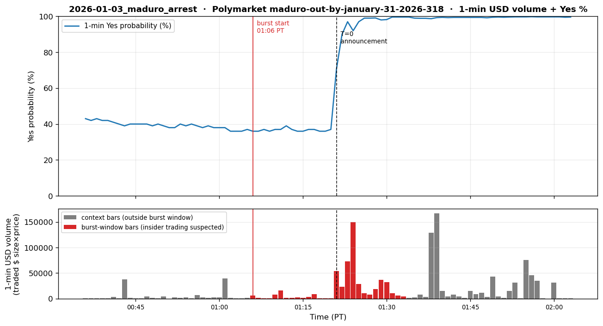
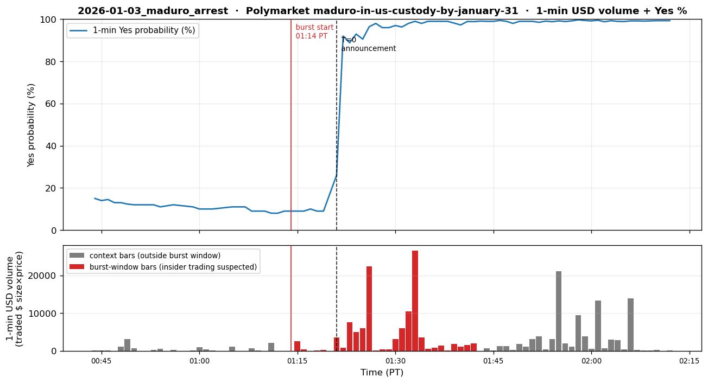

# 2026-01-03 — Venezuela Maduro Arrest (US Special Operations)

## 1. Event summary

| Field                | Value                                                                                                              |
|----------------------|--------------------------------------------------------------------------------------------------------------------|
| Official announcement | **2026-01-03 01:21 AM PT** (= 09:21 UTC) — Trump Truth Social first capture announcement. Follow-ups: 08:00 AM PT Mar-a-Lago press conference + 08:23 AM PT USS Iwo Jima photo. |
| Market impact         | Polymarket "Maduro out by Jan 2026" Yes ~5% (December baseline) → 13% (1/2 10:00 PM PT) → **95% (1/3 01:30 AM PT)** → 99.95% UMA resolve (04:14 AM PT). |
| INSIDER likelihood    | **Extreme** — 2-layer leak: ① 12/27–1/2 new-wallet 7-day gradual accumulation of $33K (PDF: last bet 1/2 18:58 PT = T-6h 23min), ② 1/3 01:06 AM PT decisive on-chain run-up (15 min before official announcement). |
| Pre-event window      | **Layer 1**: 7-day gradual (12/27 ~ 1/2 18:58 PT). **Layer 2**: decisive run-up between 1/3 01:06 → 01:34 AM PT (auto-detected burst on the `maduro-out` slug, T-15min ~ T+13min). |

## 2. Pre-event suspicious activity

The full timeline shows a **2-phase leak** pattern — 7-day gradual accumulation (Layer 1) + intraday burst on the announcement day (Layer 2).

### Phase 1 — 7-day gradual accumulation (T-7d ~ T-6h 23min)

- **When**: 2025-12-27 ~ 2026-01-02 (started ~7 days before Trump's official announcement).
- **Platform**: Polymarket (Polygon), market = "Maduro out by January 2026."
- **Direction**: Yes (Maduro removed from power).
- **Account pattern**: **1 new wallet** (created just before 12/27, no other trading history).
- **Size**: Gradual buys, totaling ~$33K accumulated.
- **Market impact**: Yes price stayed near the ~5% baseline (quiet gradual buying barely moved the price).
- **Characteristic**: Volume is small and dispersed, so it is **hard for volume-based detectors to catch** —
  identifiable only via wallet-graph methods (single_wallet_burst, fresh-wallet flag).
- **PDF cites Phase 1's last bet at `1/2 18:58 PT (= 02:58 UTC 1/3)`**
  — T-6h 23min. That timestamp is **near the boundary** of our trades-API window (current fetch
  covers from ~14:16 PT 1/2, roughly T-11h), so re-collection in P10.2 can directly verify the
  single wallet's final accumulation tx (the §9 trades aggregate is focused only on the burst
  window, so this timestamp is not included).

### Phase 2 — Event-day price discovery

Full timeline (PT primary, UTC parenthetical; combining price-history + trades data):

| Time (PT, PST) | Time (UTC) | Event | Yes price |
|---|---|---|---|
| 1/2 ~09:50 PM | 1/3 ~05:50 | US strike on Caracas (Venezuela local 1:50 AM) | ~13% |
| **1/2 10:16 PM** | **1/3 06:16** | **First leak** — Yes 13% → 48% (1-min jump) ※ price-history only | 48% |
| 1/2 10:16 PM ~ 1/3 01:05 AM | 1/3 06:16 ~ 09:05 | 3h chop window (Yes oscillates 30–66%, retraces to 37%) | 37–66% |
| **1/3 01:06 AM** | **1/3 09:06** | **Start of the `maduro-out` slug decisive burst** (data-validated) — Yes 37% → flat then jumps | 37% |
| **1/3 01:14 AM** | **1/3 09:14** | **`maduro-in-us-custody` slug burst start** | 9% |
| **1/3 01:21 AM** | **1/3 09:21** | **Trump Truth Social first capture announcement (T=0, public)** | jumping |
| 1/3 01:21 – 01:34 AM | 1/3 09:21 – 09:34 | Yes reaches ~99% quickly (public + insider joining) | 99% |
| 1/3 04:14 AM | 1/3 12:14 | UMA resolution | 99.95% |
| 1/3 08:00 AM | 1/3 16:00 | Mar-a-Lago press conference | (resolved) |
| 1/3 08:23 AM | 1/3 16:23 | USS Iwo Jima photo post | (resolved) |

#### Two points to note

1. **1/2 10:16 PM PT first leak (-185 min)** — Yes 13% → 48% one-minute jump.
   Occurred 26 minutes after the Caracas strike. Only visible **in price-history**
   (our trades fetch with its 10K cap doesn't reach back to this timestamp). In
   theory vol_burst + yes_share_v0 should fire here.

2. **1/3 01:06 ~ 01:34 AM PT decisive burst (-15 min ~ +13 min)** —
   auto-detected burst on the `maduro-out` market (red bars in the plot).
   **The actual detector-trigger signal verifiable in our trades data**:
   - +0 ~ +14 min (01:06–01:20 AM PT): Yes ~37% flat, low volume (~$1–8K/min)
   - +15 min (01:21 AM PT, T=0): Yes 38% → 70.6% (1-min jump, $54K volume)
   - +16~+20 min: Yes reaches ~99%

- **Profit**: Combining the 7-day accumulation + 1/3 01:21 AM PT pre-announcement buys: +$400K+ (~×12 ROI on $33K).
- **Timing precision** (3-stage signal):
  - **Phase 1 final bet** (PDF, on-chain accumulation): `1/2 18:58 PT` —
    **T-6h 23min** before the official announcement. At the trades-API boundary; needs re-verification in P10.2.
  - **First leak** (price-history-based): `1/2 22:16 PT (10:16 PM)` —
    **T-3h 5min** before the official announcement. Yes 13% → 48% (1-min jump,
    $250K+ recorded volume in 30-sec history snapshot).
  - **Second leak** (trades-API-based): `1/3 01:06 PT` — **T-15 min** before the official announcement.
    Start of the auto-detected decisive burst on the `maduro-out` slug (§9 quant).

### Summary

- **2-layer leak signature**: ① 7-day accumulation in a new wallet, ② decisive on-chain run-up ~15 min before
  the official announcement (+ price-history-only leak ~3h earlier).
- **Detector value**:
  - Catching Layer 1 is hard (small, dispersed) — requires wallet-graph / new-wallet flag.
  - Catching Layer 2 is possible at two stages:
    - 1/2 10:16 PM PT first leak: **price-jump detector** should fire (35-point 1-min jump).
    - 1/3 01:06 AM PT decisive run: **vol_burst + yes_share_v0** fire — the +15 min
      huge volume bar ($54K) in the plot could trigger an EMERGENCY 1 minute before T=0.

## 3. Per-channel expected detector behavior

### 3.1 Channel 1 — Polymarket (PRIMARY)

- **State**: **EMERGENCY should clearly fire**. This is the core use case for our P9.1 detector pool —
  however, since the leak is in two phases, the catchability of each phase differs.

#### Phase 1 detector behavior (T-7d ~ T-1d, gradual accumulation)

- **`vol_burst_v0` / `vol_burst_v2_tod`** (volume z-score):
  - Dispersed buying keeps z around 1–2 → **hard to catch**.
- **`directional_run_v1`** (one-direction buy streak):
  - Yes-only flow throughout the 7 days → score accumulates gradually; WATCH possible from around T-1d.
- **`single_wallet_burst_v1`** / fresh-wallet flag:
  - A new wallet takes a large share of the single market's cumulative volume → **this is the real catch
    point**. WATCH entry possible around T-3d.
- **`cusum_v1`** (change point in cumulative Yes-share):
  - Since price barely moves, the CUSUM signal is also weak. Most likely NORMAL.

#### Phase 2 detector behavior (1/2 10:16 PM ~ 1/3 01:21 AM PT, intraday burst)

- **`vol_burst_v0` / `vol_burst_v2_tod`**:
  - **1/2 10:16 PM PT first leak** (Yes 13% → 48%): volume surge → z >> 5 possible → **EMERGENCY**.
  - 10 PM PT Friday bucket is normally very quiet on Polymarket → TOD-adjusted
    z is more extreme (z ~ 8+).
- **`yes_share_v0`** (Yes price jump):
  - 1/2 10:16 PM PT: 13% → 48% (35-point jump in 1 min) → **EMERGENCY immediately**.
  - 1/3 01:06 ~ 01:30 AM PT: 37% → 95% (decisive run) → EMERGENCY reconfirmed.
- **`directional_run_v1`**: After 1/2 10:16 PM PT, almost entirely Yes-only → strong score.
- **`cusum_v1`**: Cumulative share break at 1/2 10:16 PM PT → fires.

#### Target tier timeline

```
T-7d ~ T-3d  | NORMAL                 (dispersed buys, low volume)
T-3d ~ T-1d  | WATCH                  (single_wallet_burst + directional_run)
T-1d ~ T-3h  | WATCH                  (Yes accumulation continues)
T-3h 5min    | EMERGENCY (Phase 2 leak — vol_burst + yes_share)  ← 1/2 10:16 PM PT
T-3h ~ T-15m | EMERGENCY (maintained as detector escalation holds through chop window)
T-15min~T+0  | EMERGENCY (decisive run, Yes 37% → 95%)            ← 1/3 01:06-01:21 AM PT
T+0          | EMERGENCY (Trump Truth Social public)               ← 1/3 01:21 AM PT
```

- **Verification points (P10.2)**:
  - Absolute volume value & TOD-adjusted z-score at the 1/2 10:16 PM PT first leak
  - Exact first-trade timestamp & cumulative ROI of the new wallet during the 7-day phase
- **Conclusion**: Polymarket is the **clear primary detector** for this event. Catching just the
  1/2 10:16 PM PT leak in Phase 2 enables an **EMERGENCY alert 3 hours before the official announcement
  (1/3 01:21 AM PT)**. That is enough time for the user to hedge directly in ES/CL or other markets.

### 3.2 Channel 2 — Hyperliquid

- **State**: SILENT expected.
- **Reason**: A Maduro political event has essentially nothing to do with crypto perpetuals (and even if a
  Venezuela-related token exists, none is in our watchlist (BTC/ETH/SOL)).
- **Expected detector firing**: None.
- **Conclusion**: **NORMAL**.

### 3.3 Channel 3 — CME

- **State**: **Near-SILENT expected** (Saturday pre-dawn announcement is outside regular CME hours).
  - Official announcement = 2026-01-03 **01:21 AM PT (PST) Saturday** (= 09:21 UTC).
  - CME closed Saturday. ~38h gap until the ES futures Sunday 3 PM PT open (= 1/4 11:00 PM PT
    = 1/5 07:00 UTC).
  - A gap-up can occur on Sunday open (reflecting the news) — but that's post-fact price reflection,
    not a pre-event insider signal.
- **Detector simulation targets**:
  - **`vol_z_v1` (CME ES/CL/BZ)** — **cannot catch** (market closed).
  - **`price_jump_v1`**: Sunday-open gap → jump possible immediately after re-open → post-fact
    EMERGENCY confirmation only.
- **Conclusion**: **NORMAL during the event window, possibly RISK_OFF on the Sunday open 38h later.**
  Maduro is essentially a **single-channel (Polymarket only)** event — CME has no window to catch it.

### 3.4 Channel 4 — X (Twitter)

- **State**: Post-fact forensic only.
- **Confirmed X post**:
  - **Lookonchain status `2007639475497881625`** — 2026-01-03 06:25 PM PT
    (= 1/4 02:25 UTC) = **about 17 hours after** the official announcement (1/3 01:21 AM PT). Post-fact
    forensic reporting summarizing bet wallets, sizes, and ROI. **Not the official announcement source**
    (just a tracking X account).
- **Expected detector firing**:
  - `Stage1Filter`: ticker_match (`Polymarket`), case_match (`maduro`,
    `polymarket`, `12x`), common_match (`bet`, `wallet`), regex_match
    (`usd_amount`). Score ~0.9 → Stage1 PASS.
  - `LLMClassifier`: matched_case = `2026.01.03_maduro_polymarket`,
    confidence ~0.80, NEUTRAL direction (post-fact forensic), is_pre_event=False.
    Tier = **WATCH** (doesn't reach RISK_OFF since it's post-fact).
- **Conclusion**: **WATCH** (post-fact case study accumulation only). Pre-event capture
  impossible.

## 4. Expected system_state timeline

T=0 = **2026-01-03 01:21 AM PT** (Trump Truth Social first capture announcement = 09:21 UTC).

```
T-7d           | NORMAL                                              per_channel: pm=N, hl=N, cme=N, x=N
T-5d ~ T-3d    | WATCH   (single_wallet_burst on new wallet)         per_channel: pm=W, hl=N, cme=N, x=N
T-3d ~ T-1d    | WATCH   (single_wallet_burst + directional_run combined)  per_channel: pm=W, hl=N, cme=N, x=N
T-1d ~ T-7h    | WATCH   (Phase 1 late accumulation, Yes price stays ~5%)         per_channel: pm=W, hl=N, cme=N, x=N
T-6h 23min     | WATCH (PDF Phase 1 last bet 1/2 18:58 PT — single-wallet final tx, vol_burst possible) per_channel: pm=W, hl=N, cme=-, x=N   (CME closed)
T-3h 5min      | EMERGENCY (1/2 22:16 PT first leak, Yes 13%→48%)     per_channel: pm=E, hl=N, cme=-, x=N   (CME closed)
T-3h ~ T-15min | EMERGENCY (chop window, escalation held)              per_channel: pm=E, hl=N, cme=-, x=N
T-15min~T+0    | EMERGENCY (decisive run, Yes 37%→95%)               per_channel: pm=E, hl=N, cme=-, x=N   (1/3 01:06-01:21 AM PT)
T+ 0           | EMERGENCY (Trump Truth Social public, 01:21 AM PT)  per_channel: pm=E, hl=N, cme=-, x=N
T+ 6.5h        | EMERGENCY (Mar-a-Lago press conf + photo post, 08:00-08:23 AM PT) per_channel: pm=R, hl=N, cme=-, x=W
T+17h          | RISK_OFF  (Lookonchain forensic X post, 1/3 06:25 PM PT) per_channel: pm=R, hl=N, cme=-, x=W
T+38h          | RISK_OFF? (CME ES Sunday open gap-up, 1/4 03:00 PM PT) per_channel: pm=N, hl=N, cme=R, x=N
T+ 2d          | NORMAL                                              per_channel: pm=N, hl=N, cme=N, x=N
```

**Does boost matter?** — Barely. Single-channel pattern (PM only).
PM=EMERGENCY alone is enough for system=EMERGENCY.

## 5. P10 detection target

- **Detection latency target (median ≤ 60s)**:
  - Best case (1/2 10:16 PM PT first leak — Yes 13% → 48%): the PM polling cycle
    (default 10s) catches the price jump within the first minute → EMERGENCY emit ≤ 60s.
    **But our trades fetch (10K cap) doesn't reach this timestamp, so this is verifiable only via simulation.**
  - Realistic case (1/3 01:06 AM PT decisive run — `maduro-out` slug): combined vol_burst +
    directional_run → EMERGENCY emit ≤ 60s. **The +15 min huge bar
    ($54K) in the plot is the trigger point our data validates.**
- **Warning time** (alert → public announcement at 1/3 01:21 AM PT):
  - **Best case**: ~3-hour lead (1/2 10:16 PM PT leak alert → 1/3 01:21 AM PT announcement).
  - **Realistic case**: **~15-min lead** (1/3 01:06 AM PT alert → 1/3 01:21 AM PT announcement).
  - 15 min is still enough for the user to hedge ES/CL/SPY (although most markets are closed at the time).
- **False-positive risk**:
  - Small Polymarket markets have normally very low volume, so z-scores are
    sensitive to firing. To reduce FPs:
    - Apply an absolute volume threshold (e.g., only trigger on trades of $5K+)
    - Trigger only on markets where vol_burst_v2_tod's weekday/hour baseline is sufficient (n>=tod_min_n)
  - The 13% → 48% jump on 1/2 10:16 PM PT (**35-point in 1 min**) and the
    38% → 70.6% jump on 1/3 01:21 AM PT both fire directional_run + yes_share + vol_burst simultaneously →
    very low FP probability.

## 6. Sources

- User PDF row #3.
- **Official announcement (T=0)**:
  - Trump Truth Social, 2026-01-03 **01:21 AM PT** (= 04:21 AM EST = 09:21 UTC):
    "The United States of America has successfully carried out a large scale strike
    against Venezuela and its leader, President Nicolas Maduro, who has been,
    along with his wife, captured and flown out of the Country..."
    https://truthsocial.com/@realDonaldTrump/posts/115830428767897167
  - Follow-up: Mar-a-Lago news conference, **08:00 AM PT** (= 11:00 AM EST = 16:00 UTC).
  - Photo post: Truth Social "Nicolas Maduro on board the USS Iwo Jima.",
    **08:23 AM PT** (= 11:23 AM EST = 16:23 UTC).
    https://truthsocial.com/@realDonaldTrump/posts/115832088990838303
  - Archive: https://www.presidency.ucsb.edu/documents/truth-social-posts-january-3-2026
- **Forensic (post-event, NOT official)**:
  - Lookonchain X post, 2026-01-03 **06:25 PM PT** (= 1/4 02:25 UTC, ~17h later):
    https://x.com/lookonchain/status/2007639475497881625
- **Polymarket market**: "Maduro out by Jan 2026" — slug + condition_id P10.2 lookup.
- **On-chain**: New wallet address — extractable from the Lookonchain report.

## 7. P10.2 Data Collection Checklist

- [ ] **Polymarket market lookup** — condition_id + market slug for Maduro-related markets
- [ ] **Polymarket subgraph query** — trade history of the market between 12/27 ~ 1/4 (per-trade)
- [ ] **New wallet address identification** — wallets in the Lookonchain post → on-chain etherscan/polygonscan tx
- [ ] **X post fetch** — text + image of Lookonchain status 2007639475497881625
- [x] **News timeline** — official announcement = Trump Truth Social 2026-01-03 **01:21 AM PT**
      (= 04:21 AM EST = 09:21 UTC).
- [ ] **Comparison wallets** — size distribution of other traders in the same market
      (how much of an outlier the insider new wallet was)
- [ ] **CME (closed during event)** — Saturday pre-dawn PT, so CME ES/CL/BZ are all closed.
      Only the Sunday 3 PM PT open (= 2026-01-04 23:00 UTC) gap-up is post-fact verifiable.

<!-- QUANT_SECTION_BEGIN — auto-generated by scripts/generate_historical_event_data.py -->
## 9. Quantitative replay data

_Official announcement: 2026-01-03 01:21 PT (= 09:21 UTC)._

_Per-section `t` is measured from the **section's own** T=0._  
_• Polymarket: T=0 is either the auto-detected decisive burst minute, or — when manually overridden — the start of the **insider accumulation window** (wallet-funding/wallet-splitting phase that precedes the public announcement)._  
_• CME / Hyperliquid: T=0 is the official announcement._  
_Burst (insider-suspected) rows are bold._  
_Volume columns: **buy** = taker lifted ask (long pressure), **sell** = taker hit bid (short pressure), **net** = buy − sell. Plots show buy volume above the zero line (green) and sell volume below (red), so a downward-dominant burst = short-pressure burst._

### Polymarket

#### `maduro-out-by-january-31-2026-318`

_Question_: **Maduro out by January 31, 2026?**  
_Total market volume_: $10,966,929  _Decisive burst (auto-detected)_: `2026-01-03 01:06 PT` → `2026-01-03 01:34 PT`
  _Lead time vs. announcement_: **-0.2 h** (= -15 min from T=0)

_Window aggregates_: **$509,979** traded across **699** taker trades by **372 unique wallets** (USD volume measured in our fetched 10K trade slice — earlier wallet funding outside the API's reach is **not** counted).



**1-min OHLCV** (Yes probability in %, USD volume, taker trades, unique wallets per bar):

| t (min) | open | high | low | close | usd vol | trades | wallets |
|---:|---:|---:|---:|---:|---:|---:|---:|
| -5 | 38.0% | 39.0% | 37.0% | 38.0% | $39,768 | 13 | 13 |
| -4 | 38.0% | 38.0% | 36.0% | 36.0% | $1,508 | 10 | 8 |
| -3 | 36.0% | 37.0% | 36.0% | 36.0% | $600 | 10 | 8 |
| -2 | 37.0% | 37.0% | 36.0% | 36.0% | $452 | 8 | 8 |
| -1 | 37.0% | 38.0% | 37.0% | 37.0% | $1,083 | 8 | 8 |
| **+0** | **37.0%** | **38.0%** | **36.0%** | **36.0%** | **$6,293** | **18** | **15** |
| **+1** | **37.0%** | **37.0%** | **36.0%** | **36.0%** | **$1,831** | **27** | **19** |
| **+2** | **37.0%** | **37.0%** | **36.0%** | **37.0%** | **$781** | **26** | **13** |
| **+3** | **37.0%** | **37.0%** | **36.0%** | **36.0%** | **$437** | **19** | **12** |
| **+4** | **37.0%** | **37.0%** | **36.0%** | **37.0%** | **$7,642** | **13** | **13** |
| **+5** | **37.0%** | **39.0%** | **37.0%** | **37.0%** | **$16,412** | **12** | **12** |
| **+6** | **39.0%** | **39.0%** | **37.0%** | **39.0%** | **$1,670** | **14** | **12** |
| **+7** | **39.0%** | **39.0%** | **37.0%** | **37.0%** | **$1,182** | **4** | **4** |
| **+8** | **38.0%** | **38.0%** | **36.0%** | **36.0%** | **$2,791** | **10** | **9** |
| **+9** | **37.0%** | **37.0%** | **36.0%** | **36.0%** | **$1,780** | **10** | **10** |
| **+10** | **36.0%** | **37.3%** | **36.0%** | **37.0%** | **$2,958** | **10** | **9** |
| **+11** | **36.0%** | **38.0%** | **36.0%** | **37.0%** | **$8,492** | **14** | **13** |
| **+12** | **38.0%** | **38.0%** | **36.0%** | **36.0%** | **$495** | **8** | **8** |
| **+13** | **38.0%** | **38.0%** | **36.0%** | **36.0%** | **$588** | **8** | **8** |
| **+14** | **36.0%** | **38.0%** | **36.0%** | **37.0%** | **$420** | **9** | **9** |
| **+15** | **38.0%** | **70.6%** | **37.0%** | **70.6%** | **$54,332** | **37** | **21** |
| **+16** | **72.0%** | **91.0%** | **70.0%** | **90.0%** | **$23,355** | **42** | **33** |
| **+17** | **91.2%** | **97.0%** | **80.8%** | **97.0%** | **$72,939** | **68** | **45** |
| **+18** | **97.0%** | **99.0%** | **88.0%** | **92.0%** | **$150,131** | **55** | **34** |
| **+19** | **95.0%** | **99.0%** | **95.0%** | **97.0%** | **$29,037** | **50** | **38** |
| **+20** | **98.0%** | **99.0%** | **97.0%** | **99.0%** | **$10,416** | **41** | **35** |
| **+21** | **99.0%** | **99.0%** | **97.0%** | **99.0%** | **$8,085** | **33** | **28** |
| **+22** | **99.0%** | **99.9%** | **98.0%** | **99.1%** | **$18,918** | **25** | **25** |
| **+23** | **99.1%** | **99.8%** | **98.0%** | **98.0%** | **$36,685** | **41** | **29** |
| **+24** | **98.9%** | **99.1%** | **98.2%** | **98.2%** | **$31,818** | **33** | **32** |
| **+25** | **99.6%** | **99.8%** | **99.6%** | **99.6%** | **$10,515** | **27** | **23** |
| **+26** | **99.7%** | **99.8%** | **99.6%** | **99.6%** | **$6,089** | **23** | **21** |
| **+27** | **99.8%** | **99.8%** | **99.6%** | **99.6%** | **$3,874** | **22** | **22** |
| +28 | 99.6% | 99.7% | 99.6% | 99.6% | $1,373 | 30 | 23 |
| +29 | 99.5% | 99.7% | 98.7% | 99.0% | $2,183 | 32 | 23 |
| +30 | 99.0% | 99.0% | 98.4% | 98.9% | $7,822 | 35 | 32 |
| +31 | 98.9% | 99.0% | 98.5% | 98.9% | $3,010 | 19 | 16 |
| +32 | 98.9% | 99.0% | 98.5% | 98.7% | $128,580 | 36 | 32 |
| +33 | 98.7% | 99.3% | 98.5% | 99.3% | $167,244 | 37 | 35 |


#### `maduro-in-us-custody-by-january-31`

_Question_: **Maduro in U.S. custody by January 31?**  
_Total market volume_: $11,034,070  _Decisive burst (auto-detected)_: `2026-01-03 01:14 PT` → `2026-01-03 01:43 PT`
  _Lead time vs. announcement_: **-0.1 h** (= -7 min from T=0)

_Window aggregates_: **$108,463** traded across **255** taker trades by **143 unique wallets** (USD volume measured in our fetched 10K trade slice — earlier wallet funding outside the API's reach is **not** counted).



**1-min OHLCV** (Yes probability in %, USD volume, taker trades, unique wallets per bar):

| t (min) | open | high | low | close | usd vol | trades | wallets |
|---:|---:|---:|---:|---:|---:|---:|---:|
| -5 | 10.0% | 10.0% | 9.0% | 9.0% | $27 | 2 | 2 |
| -4 | 9.0% | 9.0% | 9.0% | 9.0% | $2 | 1 | 1 |
| -3 | 9.0% | 10.0% | 8.0% | 8.0% | $2,159 | 5 | 5 |
| -2 | 8.0% | 8.0% | 8.0% | 8.0% | $10 | 1 | 1 |
| -1 | 9.0% | 9.0% | 9.0% | 9.0% | $1 | 1 | 1 |
| **+1** | **9.0%** | **10.0%** | **9.0%** | **9.0%** | **$2,609** | **7** | **7** |
| **+2** | **8.0%** | **9.0%** | **8.0%** | **9.0%** | **$405** | **4** | **2** |
| **+3** | **10.0%** | **10.0%** | **10.0%** | **10.0%** | **$4** | **1** | **1** |
| **+4** | **9.0%** | **10.0%** | **9.0%** | **9.0%** | **$115** | **3** | **3** |
| **+5** | **10.0%** | **10.0%** | **9.0%** | **9.0%** | **$253** | **6** | **6** |
| **+7** | **10.0%** | **26.0%** | **9.0%** | **26.0%** | **$3,497** | **8** | **4** |
| **+8** | **29.1%** | **92.0%** | **25.0%** | **92.0%** | **$847** | **6** | **3** |
| **+9** | **94.0%** | **94.0%** | **86.4%** | **88.8%** | **$7,510** | **3** | **3** |
| **+10** | **89.0%** | **93.0%** | **46.0%** | **93.0%** | **$4,927** | **14** | **12** |
| **+11** | **93.0%** | **95.0%** | **82.0%** | **90.6%** | **$5,975** | **18** | **15** |
| **+12** | **94.0%** | **96.5%** | **92.0%** | **96.5%** | **$22,373** | **14** | **14** |
| **+13** | **98.0%** | **98.0%** | **96.8%** | **98.0%** | **$31** | **6** | **6** |
| **+14** | **98.0%** | **98.0%** | **96.0%** | **96.0%** | **$361** | **21** | **13** |
| **+15** | **96.0%** | **98.0%** | **96.0%** | **96.0%** | **$373** | **7** | **6** |
| **+16** | **97.0%** | **98.0%** | **95.0%** | **97.0%** | **$3,133** | **10** | **9** |
| **+17** | **98.0%** | **98.0%** | **95.0%** | **96.3%** | **$6,032** | **11** | **10** |
| **+18** | **95.6%** | **98.0%** | **95.6%** | **98.0%** | **$10,440** | **15** | **14** |
| **+19** | **99.0%** | **99.0%** | **96.9%** | **99.0%** | **$26,602** | **18** | **18** |
| **+20** | **98.0%** | **99.6%** | **97.0%** | **98.0%** | **$3,609** | **14** | **10** |
| **+21** | **99.8%** | **99.8%** | **98.7%** | **99.0%** | **$524** | **5** | **5** |
| **+22** | **99.0%** | **99.4%** | **98.2%** | **99.0%** | **$789** | **7** | **6** |
| **+23** | **98.3%** | **99.0%** | **98.1%** | **99.0%** | **$1,378** | **7** | **6** |
| **+24** | **99.0%** | **99.6%** | **98.0%** | **99.0%** | **$141** | **7** | **5** |
| **+25** | **98.1%** | **99.0%** | **98.1%** | **98.1%** | **$1,791** | **10** | **10** |
| **+26** | **99.0%** | **99.4%** | **97.3%** | **97.3%** | **$1,161** | **15** | **12** |
| **+27** | **97.9%** | **98.9%** | **97.9%** | **98.9%** | **$1,596** | **8** | **6** |
| **+28** | **99.0%** | **99.3%** | **98.8%** | **98.8%** | **$1,974** | **10** | **10** |
| +29 | 99.1% | 99.1% | 99.1% | 99.1% | $1 | 1 | 1 |
| +30 | 99.3% | 99.3% | 98.7% | 99.0% | $740 | 4 | 4 |
| +31 | 99.0% | 99.0% | 99.0% | 99.0% | $36 | 3 | 3 |
| +32 | 99.0% | 99.4% | 98.2% | 99.4% | $1,218 | 9 | 9 |
| +33 | 99.1% | 99.1% | 99.0% | 99.0% | $1,196 | 3 | 3 |
| +34 | 98.2% | 98.5% | 98.0% | 98.0% | $267 | 5 | 5 |


### CME

**CME silent — expected.** Trump's first Truth Social capture announcement went out 2026-01-03 **01:21 AM PT** (= 04:21 AM EST = 09:21 UTC) — a Saturday early morning when CME equity/oil/metals futures are closed.  ES/CL/BZ/GC re-opened Sunday 3 PM PT (~38 h later) with a gap-up, but no in-event volume burst was possible.

<!-- QUANT_SECTION_END -->
