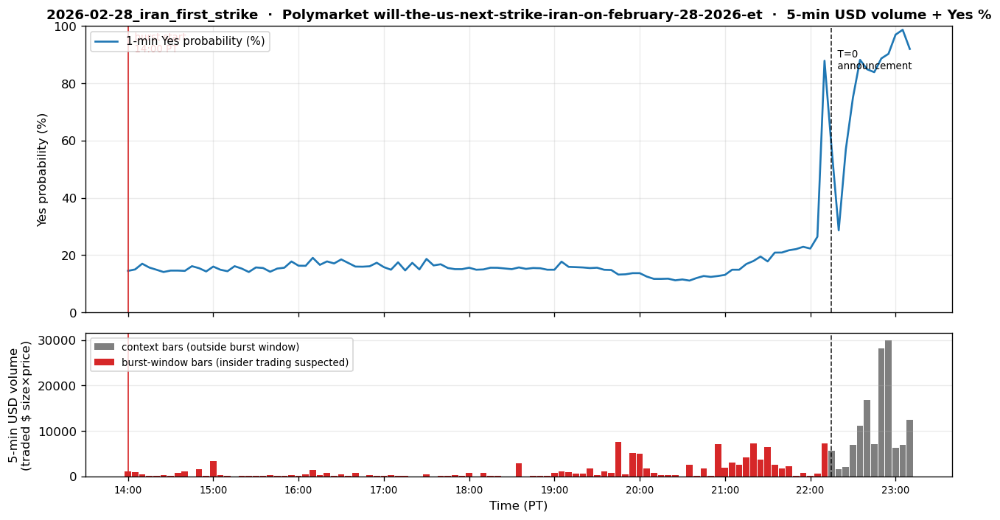

# 2026-02-28 — US/Israel Iran First Strike

## 1. Event summary

| Field                | Value                                                                                  |
|----------------------|----------------------------------------------------------------------------------------|
| Announcement time    | **2/27 22:00–22:15 PT** (= 2026-02-28 06:00–06:15 UTC) — **"Operation Epic Fury"** (joint Israel-US strike). Trump Truth Social 8-min video (~22:00–22:12 PT) → Polymarket price jump (22:12 PT) → IDF sirens, Iran retaliatory missile alert (22:15 PT = 08:15 IST 2/28 Sat). |
| Market impact        | **Polymarket** "strike by 2/28" Yes: **23% → 87% jump in 1 minute at 22:12 PT** (effectively simultaneous with the announcement). In the 8 hours just before, **207+ wallets accumulated dispersedly with no price impact** (= wallet-splitting effect confirmed by data; see §9). **CME oil/equity futures** were closed Saturday pre-dawn → no pre-hedging possible; sell-off started from Sunday ES open. |
| INSIDER likelihood   | **Extremely high** — 38+ accounts dispersed wallet splitting, wallet funding 6 days in advance, 22 of 23 binary events correct (93%+, Lookonchain/Polymarket whale reports). Even within the data-visible window (-8.25h ~ T=0) alone, 207 wallets / $108K USD pre-announcement accumulation is confirmed. |
| Pre-event window     | 6 days (2/22 wallet funding → **2/27 03:00 PT (= 11:00 UTC)** "main betting start" → **2/27 22:15 PT (= 2/28 06:15 UTC)** announcement). Window visible via our trade-API slice begins at 2/27 14:00 PT (= 22 UTC). |

## 2. Pre-event suspicious activity

- **When (T-window, PT primary)** — T=0 = **2/27 22:15 PT**:
  - **T-6d** (2/22): start of crypto (USDC) transfers to 38 new/reactivated wallets.
  - **T-19h 15min ~ T-18h 15min** (**2/27 03:00–04:00 PT** = 11:00–12:00 UTC):
    main betting starts — 38 accounts buy Yes simultaneously (dispersed within a 1-hour window).
- **Platform**: Polymarket + Kalshi (both suspected to be the same trader).
- **Direction**: "2/28 Iran strike" Yes (attack occurs within February).
- **Account pattern**: **wallet splitting — 38 dispersed accounts** (each wallet circumvents size limits).
  Suspected to be a single individual (not confirmed). 22 of 23 binary events correct (93%+) — same
  pattern across other geopolitical markets too.
- **Profit**: +$2M+ (sum across 38 wallets, per Lookonchain/Polymarket whale reports), traded
  volume $500M+ (full 6-day cumulative).
- **Timing precision**: **~19 hours 15 min** (announcement T=0 = **2/27 22:15 PT (= 2/28 06:15 UTC)**,
  main betting start T-19h = **2/27 03:00 PT (= 11:00 UTC)**). The capital-preparation phase that
  began 6 days earlier (2/22) is an even stronger insider signal. **Within the data-visible window
  (= 2/27 14:00 PT ~ T=0, ~8.25h)**, 207 wallets / $108K pre-accumulation is directly confirmed
  (see §9 quant data).

## 3. Per-channel expected detector behavior

### 3.1 Channel 1 — Polymarket (PRIMARY)

- **State**: **EMERGENCY target**. Our detector is aggregate-volume/share based, so it catches
  the activity even when split across 38 wallets. However, catches **start from the betting-start
  point (T-1d 03:00 PT)** — the funding-only stage (T-6d) is deliberately not caught (FP concerns).
- **Detector simulation (T-6d ~ T+0)**:
  - **`vol_burst_v0`** (overall market volume z-score):
    - T-6d: NORMAL (transfers only, no bets)
    - T-1d 03:00-04:00 PT (main betting starts): 38 accounts buy Yes simultaneously → cumulative
      volume z >> 5 vs hourly baseline. **EMERGENCY**.
    - T+0 (announcement): vol_burst even stronger.
  - **`vol_burst_v2_tod`** (TOD-adjusted): The 03–04 PT bucket is normally very
    quiet → z is more extreme. **EMERGENCY confirmed**.
  - **`yes_share_v0`**: Yes price surges from ~10–20% to 50–70%. **RISK_OFF**.
  - **`directional_run_v1`**: 38 accounts all unidirectional Yes → **RISK_OFF/EMERGENCY**.
  - **`cusum_v1`**: Cumulative Yes-share break point → fires.
- **Wallet splitting handling — our detector's strength**:
  - 38 accounts bet the same direction (Yes) on the same market within 1 hour
    → aggregate volume z >> 5 vs hourly baseline → vol_burst fires normally.
  - Thus **wallet splitting itself does not evade our detector** (provided betting starts).
  - Forensically separating "suspected same-actor clusters" is not the detector's job
    (that's the CFTC/SEC's). We only need to emit "an anomaly exists at this time."
  - **To verify in P10**: Whether vol_burst sensitivity is enough to catch a 1-hour burst from 38 accounts
    (threshold tuning).
- **Expected tier-emit timeline** (PT primary):
  - T-6d ~ T-2d (2/22 ~ 2/26): NORMAL (transfers only, zero bets)
  - **2/27 03:00 PT** (T-19h 15min): WATCH (vol_burst enters)
  - **2/27 03:30 PT** (T-18h 45min): RISK_OFF (vol_burst + cusum)
  - **2/27 04:00 PT** (T-18h 15min): **EMERGENCY** (vol_burst_v2_tod + directional_run + yes_share)
  - **2/27 22:15 PT** (T=0): EMERGENCY (price polish at announcement)
- **Conclusion**: Our system emits EMERGENCY normally. Warning time **~19 hours 15 min**
  (2/27 03:00 PT main bet → 2/27 22:15 PT announcement). But the **6-day-prior wallet-prep stage
  is not caught by our detector** (because they only transferred, didn't bet).
  This is a meaningful detection gap → consider in P10.5 adding a wallet-funding-without-betting
  tracking detector.

### 3.2 Channel 2 — Hyperliquid

- **State**: SILENT or weak secondary.
- **Reason**: If the user PDF's "transfer of crypto to accounts starting 2/22" was a USDC transfer to
  Hyperliquid, our Hyperliquid wallet-activity detector could catch it. But the user's note suggests the
  transfer funded Polymarket (bridge to Polygon).
- **Expected detector firing**:
  - If there were simultaneous deposits to 38 Hyperliquid accounts, `cluster_v1` (cluster of
    fresh wallets) could fire at T-6d.
- **Conclusion**: NORMAL assumed for now. If Hyperliquid transfers are confirmed, **WATCH**
  is possible — Hyperliquid's cluster detector may offer a lead-time advantage.

### 3.3 Channel 3 — CME

- **State**: **Not caught manually by the user, but highly valuable for detector validation**.
  The first US/Israel strike heavily impacts both oil and equities → someone likely
  shorted ES / oil long pre-event. If our detector catches it, it's a big win
  (a strong input for parameter tuning).
- **Detector simulation targets (all symbols)**:
  - **`vol_z_v1` (CME ES)** — **key verification**:
    - In hindsight, ES sells off immediately post-announcement (geopolitical risk-off).
    - Verify whether ES 1-min volume z spiked during the pre-event window (T-1d ~ T-1h).
      If someone bought SPY puts / shorted ES, it gets caught.
    - **If detected**: PM primary + ES secondary corroboration → boost.
  - **`vol_z_v1` (CME CL/BZ)** — **key verification**:
    - An Iran strike implies oil-supply concerns → oil price spike is the canonical reaction.
      If someone went long oil pre-event, vol_z spike + (post-T+0) price_jump.
    - In P10.2, fully verify the 1-min vol z time series for WTI (CL) / Brent (BZ).
  - **`vol_z_v1` (CME BTC futures)**:
    - BTC also often sells off in geopolitical risk-off → possible BTC short pre-event.
      Weak to moderate signal possible.
  - **`price_jump_v1` (all symbols)**:
    - Right after T+0: ES drops, oil surges → EMERGENCY post-fact confirmation.
- **Conclusion (tentative)**:
  - Post-fact EMERGENCY is certain (both oil and ES have large jumps).
  - **Pre-event signal is determined by P10.2.** If a vol_z spike is found in ES or oil
    pre-event, this case becomes a strong corroboration for dual-channel (PM + CME) detector
    validation. **If the detector catches something the user's manual analysis missed → biggest
    win candidate for P10**.

### 3.4 Channel 4 — X (Twitter)

- **State**: Post-fact forensic.
- **Confirmed X post**: Lookonchain / Polymarket Whale Watcher post-fact reports of the 38-wallet
  pattern. Status ID needs P10.2 lookup.
- **Expected detector firing**:
  - `Stage1Filter`: ticker_match (`Polymarket`, `Iran`), case_match
    (`polymarket`, `wallet splitting`, `38`), common_match (`bet`, `wallet`,
    `coordinated`), regex_match (`usd_amount`). Score ~1.0 → Stage1 PASS.
  - `LLMClassifier`: matched_case = `2026.02.28_polymarket_iran_strike` (or
    similar case), confidence ~0.80, NEUTRAL/SELL direction (geopolitical risk),
    is_pre_event=False (post-fact). Tier = **WATCH**.
- **Conclusion**: WATCH (post-fact case study). Pre-event capture impossible.

## 4. Expected system_state timeline

T=0 = **2/27 22:15 PT** (= 2/28 06:15 UTC).

```
T-6d (2/22)         | NORMAL  (wallet-funding stage, zero bets — undetected)     per_channel: pm=N, hl=N, cme=N, x=N
T-2d (2/26)         | NORMAL                                                per_channel: pm=N, hl=N, cme=N, x=N
T-19h15m (2/27 03:00 PT) | WATCH    (PM vol_burst enters)                       per_channel: pm=W, hl=N, cme=N, x=N
T-18h45m (2/27 03:30 PT) | RISK_OFF (PM vol_burst + cusum)                    per_channel: pm=R, hl=N, cme=N, x=N
T-18h15m (2/27 04:00 PT) | EMERGENCY (PM full pool fires)                      per_channel: pm=E, hl=N, cme=N, x=N
T+0   (2/27 22:15 PT)| EMERGENCY (announcement)                              per_channel: pm=E, hl=N, cme=-, x=N   (CME closed Sat)
T+1d  (2/28 22:15 PT)| RISK_OFF                                              per_channel: pm=R, hl=N, cme=-, x=W
T+2d  (3/1 15:00 PT) | RISK_OFF (CME ES Sunday open gap-down)                per_channel: pm=N, hl=N, cme=R, x=W
```

## 5. P10 detection target

- **Detection latency target**: **2/27 04:00 PT (T-18h 15min)** PM EMERGENCY → alert ≤ 60s.
- **Warning time**: **~18 hours 15 min** (alert→announcement; excellent — the user can adjust portfolio
  for almost a full day). Lead-time from the PDF "main betting start" is ~19h 15min,
  but the detector needs an additional 30–60 min of escalation before firing.
- **Detection gap (improvement needed)**:
  - **6-day-prior wallet-funding stage undetected** — simultaneous funding of 38 new wallets is itself
    a strong insider signal, but our detector fires only once betting occurs. **P10.5 enhancement**:
    monitor Polymarket "fresh wallet creation rate" per market or per category.
  - **Wallet correlation/clustering** — review adding a Polymarket cross-wallet cluster detector
    (analogous to Hyperliquid's `cluster_v1`).
- **False-positive risk**:
  - When vol_burst + cusum + directional_run all fire simultaneously, the signal is typically strong
    — FPs are low.
  - However, "popular politics markets" often see vol_bursts (election events, etc.) →
    differentiate baselines by market category.

## 6. Sources

- User PDF row #4.
- News reference: 2026-02-28 US/Israel Iran first strike announcement (exact URL +
  timestamp in P10.2).
- Lookonchain X post: status ID needs P10.2 lookup.
- Polymarket markets: "Iran strike by Feb 2026" + Kalshi mirror market.
- 38 wallet address list — Polymarket whale tracker / Lookonchain reports.

## 7. P10.2 Data Collection Checklist

- [ ] **Iran strike Polymarket market lookup** — condition_id + slug
- [ ] **Kalshi market** — verify cross-platform simultaneous bets on the same event
- [ ] **38 wallet address identification** — Lookonchain / Polymarket whale watcher reports
- [ ] **Polymarket subgraph query** — trade history of the market between 2/22 ~ 2/28
- [ ] **2/22 funding tx identification** — each wallet's first USDC inflow tx (on-chain)
      (reference — won't be caught by the detector, but useful for post-fact forensic analysis)
- [ ] **X post fetch** — Lookonchain (post-fact) post status ID
- [ ] **News timeline** — exact announcement time
- [ ] **Wallet clustering analysis** — trace common funding-source ancestor across 38 wallets
      (Etherscan trace, for reference)
- [ ] **CME ES (E-mini S&P) 1-min OHLCV** — Databento, 2026-02-22 ~ 2026-02-28
      (6-day window). **Verify ES vol_z pre-event spike missed in the user manual.**
      If a spike is found, huge win — strong input for parameter tuning.
- [ ] **CME WTI (CL) 1-min OHLCV** — same window. An Iran strike provides large incentive for oil long,
      so check whether someone went long oil pre-event.
- [ ] **CME Brent (BZ) 1-min OHLCV** — same window. Similar to WTI.
- [ ] **CME BTC futures** — verify possibility of BTC short pre-event in geopolitical risk-off.
- [ ] **Quantify post-strike price changes** — ES, CL, BZ, BTC announcement T+0 ~ T+1d returns
      (confirm the user's note "big stock-price moves").

<!-- QUANT_SECTION_BEGIN — auto-generated by scripts/generate_historical_event_data.py -->
## 9. Quantitative replay data

_Official announcement: 2026-02-27 22:15 PT (= 06:15 UTC)._

_Per-section `t` is measured from the **section's own** T=0._  
_• Polymarket: T=0 is either the auto-detected decisive burst minute, or — when manually overridden — the start of the **insider accumulation window** (wallet-funding/wallet-splitting phase that precedes the public announcement)._  
_• CME / Hyperliquid: T=0 is the official announcement._  
_Burst (insider-suspected) rows are bold._  
_Volume columns: **buy** = taker lifted ask (long pressure), **sell** = taker hit bid (short pressure), **net** = buy − sell. Plots show buy volume above the zero line (green) and sell volume below (red), so a downward-dominant burst = short-pressure burst._

### Polymarket

#### `will-the-us-next-strike-iran-on-february-28-2026-et`

_Question_: **Will the US next strike Iran on February 28, 2026 (ET)?**  
_Total market volume_: $5,837,357  _Insider accumulation window (manual override)_: `2026-02-27 14:00 PT` → `2026-02-27 22:15 PT`
  _Lead time vs. announcement_: **-8.2 h** (= -495 min from T=0)

_Window aggregates_: **$107,792** traded across **1,217** taker trades by **207 unique wallets** (USD volume measured in our fetched 10K trade slice — earlier wallet funding outside the API's reach is **not** counted).



**1-hour OHLCV** (Yes probability in %, USD volume, taker trades, unique wallets per bar):

| t (min) | open | high | low | close | usd vol | trades | wallets |
|---:|---:|---:|---:|---:|---:|---:|---:|
| **+0** | **14.0%** | **17.0%** | **13.2%** | **14.3%** | **$6,712** | **126** | **37** |
| **+60** | **18.8%** | **24.2%** | **14.0%** | **17.8%** | **$5,047** | **120** | **30** |
| **+120** | **17.9%** | **19.5%** | **15.0%** | **17.3%** | **$4,769** | **102** | **31** |
| **+180** | **15.1%** | **18.7%** | **14.5%** | **15.1%** | **$1,571** | **54** | **16** |
| **+240** | **14.9%** | **15.7%** | **14.8%** | **14.9%** | **$4,508** | **42** | **19** |
| **+300** | **15.8%** | **18.5%** | **13.0%** | **13.7%** | **$20,913** | **185** | **45** |
| **+360** | **13.0%** | **13.8%** | **11.1%** | **12.7%** | **$19,920** | **200** | **50** |
| **+420** | **12.7%** | **22.9%** | **12.1%** | **22.9%** | **$36,342** | **329** | **33** |
| **+480** | **22.1%** | **98.9%** | **19.9%** | **90.3%** | **$117,423** | **475** | **184** |
| +540 | 96.8% | 98.7% | 42.2% | 92.0% | $25,591 | 89 | 63 |


### CME

**CME silent at announcement — expected.** The strike landed **2/27 22:15 PT (= 2/28 06:15 UTC = 01:15 ET Saturday)**, well outside CME equity/oil weekend hours.  Sunday 15:00 PT ES re-open showed gap-down (sell-off was unblockable for retail), but that's post-event reaction, not insider leak.

> ⚠ **Pre-event CME weekday data not yet collected**: PDF "main betting start" = **2/27 03:00 PT (Friday)** — from this moment CME ES / CL / BZ were **trading during the Friday session**.  §3.3 flags "ES/CL/BZ vol_z pre-event spike P10.2 verification needed" — currently not collected in this .md. Verifying whether someone hedged with SPY puts / ES short / WTI long would make this a PM-primary + CME-secondary corroboration case (see CME items in the §7 checklist).

<!-- QUANT_SECTION_END -->
