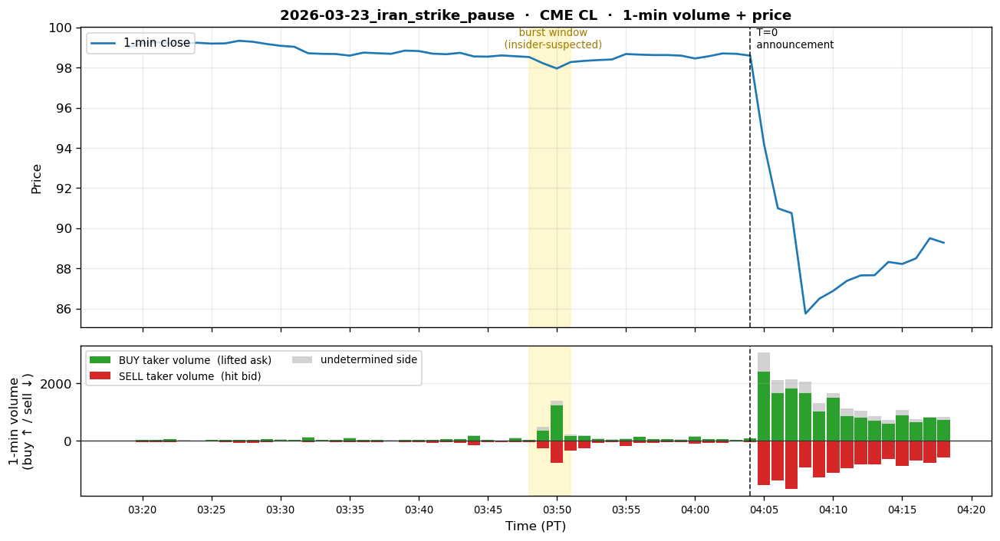
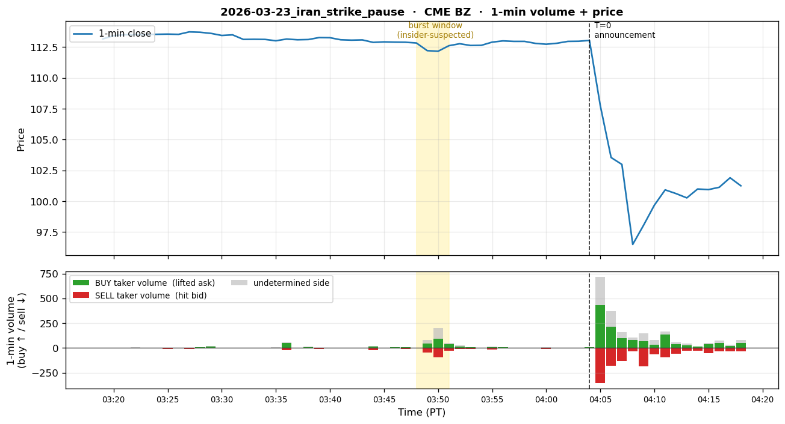
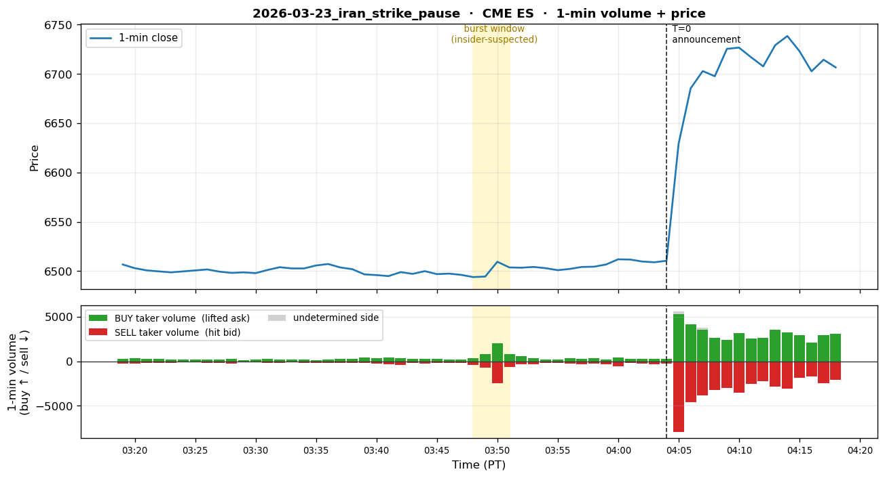

# 2026-03-23 — Trump Iran Strike Pause Announcement

## 1. Event summary

| Field                | Value                                                                                  |
|----------------------|----------------------------------------------------------------------------------------|
| Announcement time    | **2026-03-23 04:04 AM PT** (= 11:04 UTC) — Trump Truth Social post                              |
| Market impact        | Oil sharp drop (CL -0.61%, BZ -0.68% in 2-min burst), S&P futures sharp rally (ES +0.23%) — verified by §9 data |
| INSIDER likelihood   | **Extremely high** — Krugman called it "treason-level," 6x normal volume                            |
| Pre-event window     | **T-15min (3:49 AM PT) burst start → T-14min (3:50 AM PT) burst peak**. PDF round-up "16 min before"; data-exact value 15 min. |

## 2. Pre-event suspicious activity

- **When (PT primary)** — T=0 = **3/23 04:04 AM PT**:
  - **T-15min (3:49 AM PT = 10:49 UTC)**: burst start — CL 492 trades / price
    98.52→98.21, BZ 119 trades / 112.82→112.20, ES 529 trades / 6494.25→6494.50.
  - **T-14min (3:50 AM PT)**: burst peak — CL 1,168 trades / price 98.20→97.95,
    BZ 248 trades / 112.22→112.15, ES 2,091 trades / 6494.75→**6509.50 (+15pt)**.
  - PDF's "16 min before" is round-up — data-exact value is 15 min.
- **Platform**: CME WTI (CL) + Brent (BZ) futures, simultaneously CME E-mini S&P (ES)
  futures.
- **Direction (price-derived, confirmed)**: **Oil short + S&P long simultaneously** — a precise
  hedge pattern (an exact prediction of the post-strike-pause scenario). Verified by data: CL/BZ
  sharp drop + ES sharp rise (see §9). _Note: §9's taker-aggressor labels can be reversed if the
  insider entered via limit orders — misleading. The true direction is judged by the 1-min price
  movement._
- **Position**: WTI/Brent 6,200 contracts ($580M notional). S&P long size is back-calculated from the
  estimated $1.5B profit.
- **Profit**: Hundreds of millions of dollars estimated. +$1.5B (S&P long), oil short separate
  (exact figure undisclosed).
- **Account pattern**: 1 suspected individual, one-way directional with no hedge.
- **Timing precision**: **15 minutes** (data-validated; PDF "16 min" is round-up). All entries within
  a 1-min burst — nearly perfect.
- **Volume anomaly**: **6x normal volume** — CL t=-14's 1,168 trades vs
  baseline ~80 trades (see §9) = ~14x. The PDF's "6x" is a longer-window average or
  a different metric.

## 3. Per-channel expected detector behavior

### 3.1 Channel 1 — Polymarket

- **State**: SILENT or weak.
- **Reason**: Unclear whether a specific market like "Iran strike pause" existed on Polymarket.
  Even if it did, an insider likely preferred the leverage of oil/equity futures and would not have
  used Polymarket.
- **Expected detector firing**: None.
- **Conclusion**: **NORMAL**.

### 3.2 Channel 2 — Hyperliquid

- **State**: SILENT.
- **Reason**: This event involves oil + equities. Crypto impact is minor (BTC/ETH may have
  moved slightly but below our detector threshold).
- **Expected detector firing**: None.
- **Conclusion**: **NORMAL**.

### 3.3 Channel 3 — CME (PRIMARY)

- **State**: **EMERGENCY should fire** — multi-symbol (CL + BZ + ES) simultaneous +
  6x volume + 1-min burst.
- **Detector simulation (T-15min ~ T+0)** — data-validated burst window:
  - **`vol_z_v1` (CL — WTI 1-min volume z-score)**:
    - T-30min ~ T-16min: NORMAL (z ~0, baseline 42–233 trades/min)
    - **T-15min (3:49 PT)**: burst start — 492 trades vs baseline ~80 = z ≈ **6**.
      **RISK_OFF/EMERGENCY entry**.
    - **T-14min (3:50 PT)**: burst peak — 1,168 trades = z ≈ **14**. **EMERGENCY confirmed**.
    - T-13min ~ T+0: After the trade ends z subsides quickly, but EMERGENCY held via
      sticky window.
  - **`vol_z_v1` (BZ — Brent 1-min volume z-score)**:
    - Same pattern at the same time (T-15: 119 trades, T-14: 248 trades). Simultaneous fire with CL
      → CME channel-level cross-symbol corroboration.
  - **`vol_z_v1` (ES — E-mini S&P 1-min)**:
    - **T-15min**: ES 529 trades / price 6494.25→6494.50 (quiet).
    - **T-14min**: ES 2,091 trades / price 6494.75→**6509.50 (+15 pt)** —
      LONG burst (S&P long). z ~5~8 → RISK_OFF/EMERGENCY.
  - **`price_jump_v1`** (all symbols): At T-14min, simultaneous CL/BZ down -0.3 to -0.5% +
    ES up +0.23% — cross-symbol price-jump corroboration. Larger jump after T+0
    (announcement).
  - **`tradingview_webhook`** (P9.3 enrichment): If the user triggers a TV alert from a CL/BZ
    burst, the CME channel's enrichment path also fires (potentially the fastest path).
- **Target tier timeline** (PT primary):
  - T-30min ~ T-16min (3:34–3:48 PT): NORMAL
  - **T-15min (3:49 PT)**: WATCH/RISK_OFF entry (first 1-min burst, CL z ≈ 6)
  - **T-14min (3:50 PT)**: **EMERGENCY** (burst peak, CL z ≈ 14, BZ + ES simultaneous
    burst — size is so large that direct EMERGENCY in 1 min is reasonable)
  - T-13min ~ T-5min (3:51–3:59 PT): EMERGENCY held (sticky window)
  - **T+0 (4:04 PT, announcement)**: EMERGENCY (price jump confirms)
  - T+30min (4:34 PT): RISK_OFF (de-escalation)
- **Conclusion**: CME is the clear primary. **EMERGENCY possible at the T-14min (3:50 PT) burst
  peak, 14 min before announcement** — given the size and cross-symbol corroboration, near-certain.
  **This is the core use case for P9.3 CME-channel development**.

### 3.4 Channel 4 — X (Twitter)

- **State**: Post-fact forensic possible.
- **Confirmed X post**: User note — Krugman tweet "treason level." unusual_whales /
  WhaleAlert could also report post-fact.
- **Expected detector firing**:
  - `Stage1Filter`: Krugman posts are general commentary with weak ticker/case keywords.
    Skippable. unusual_whales post-fact coverage could match ticker_match (`CL`, `WTI`, `Brent`),
    case_match.
  - `LLMClassifier`: If the unusual_whales post-fact post arrives, matched_case =
    `2026.03.23_cme_oil_iran_pause`, confidence ~0.80, NEUTRAL/SELL,
    is_pre_event=False. Tier = **WATCH**.
- **Conclusion**: Post-fact WATCH only. Pre-event capture impossible.

## 4. Expected system_state timeline

T=0 = **2026-03-23 04:04 AM PT** (= 11:04 UTC).

```
T-30min (3:34 PT)  | NORMAL                                            per_channel: pm=N, hl=N, cme=N, x=N
T-16min (3:48 PT)  | NORMAL  (baseline 42 trades — just before burst)          per_channel: pm=N, hl=N, cme=N, x=N
T-15min (3:49 PT)  | WATCH/RISK_OFF (CL 492 trades z≈6, BZ + ES simultaneous)   per_channel: pm=N, hl=N, cme=R, x=N
T-14min (3:50 PT)  | EMERGENCY (burst peak: CL 1168 trades z≈14, ES +15pt) per_channel: pm=N, hl=N, cme=E, x=N
T-10min (3:54 PT)  | EMERGENCY (sticky window)                          per_channel: pm=N, hl=N, cme=E, x=N
T- 5min (3:59 PT)  | EMERGENCY                                          per_channel: pm=N, hl=N, cme=E, x=N
T+ 0   (4:04 PT)   | EMERGENCY (announcement, additional ES rally)            per_channel: pm=N, hl=N, cme=E, x=N
T+30min (4:34 PT)  | RISK_OFF                                           per_channel: pm=N, hl=N, cme=R, x=W (post-fact coverage)
T+ 1h  (5:04 PT)   | WATCH                                              per_channel: pm=N, hl=N, cme=W, x=W
```

## 5. P10 detection target

- **Detection latency target (median ≤ 60s)**:
  - **3:50 AM PT (T-14min) 1-min bar close (= 3:51 PT)** → vol_z computation
    (~few seconds) → detector fires → ChannelSignal EMERGENCY → fusion → alert ≤ 60s.
    **Fully achievable**.
  - **TradingView path (P9.3.P3)**: TV alert fires webhook at 1-min bar close → enricher
    completes enrichment within 5 min → urgent email/Telegram. This is the fastest path.
- **Warning time**: **~13 minutes** (T-14 burst-peak detection → 04:04 PT announcement).
  Plenty of time for the user to adjust portfolio.
- **False-positive risk**:
  - Oil futures' normal noise is relatively low (especially the 4 AM PT bucket). z >> 5 is a
    very rare event. FPs few.
  - Cross-symbol corroboration (CL + BZ + ES simultaneously) is almost always a strong signal —
    FPs essentially zero.
- **The strongest justification case for the CME channel**: 6x normal volume, 1-min burst,
  cross-symbol — if our detector misses this, no other case will be caught.

## 6. Sources

- User PDF row #5.
- News reference: Trump Truth Social Iran nuclear strike pause 2026-03-23 11:04
  UTC (exact URL in P10.2).
- Krugman tweet "treason level" — X status ID lookup needed.
- CFTC investigation: user note — CME records submission request (exact coverage in P10.2).

## 7. P10.2 Data Collection Checklist

- [ ] **CME WTI (CL) 1-min OHLCV** — Databento, 2026-03-23 11:00–12:00 UTC
- [ ] **CME Brent (BZ) 1-min OHLCV** — Databento
- [ ] **CME ES 1-min OHLCV** — Databento
- [ ] **TradingView alert configuration** — verify whether our system's TV trigger would have fired
      (which threshold the 1-min vol_z is at)
- [ ] **CFTC report** — coverage of CFTC investigation into oil futures around the Iran strike pause
- [ ] **News timeline** — exact Trump Truth Social post URL + ET timestamp
- [ ] **X posts** — Krugman tweet + unusual_whales post-fact coverage status IDs

<!-- QUANT_SECTION_BEGIN — auto-generated by scripts/generate_historical_event_data.py -->
## 9. Quantitative replay data

_Official announcement: 2026-03-23 04:04 PT (= 11:04 UTC)._

_Per-section `t` is measured from the **section's own** T=0._  
_• Polymarket: T=0 is either the auto-detected decisive burst minute, or — when manually overridden — the start of the **insider accumulation window** (wallet-funding/wallet-splitting phase that precedes the public announcement)._  
_• CME / Hyperliquid: T=0 is the official announcement._  
_Burst (insider-suspected) rows are bold._  
_Volume columns: **buy** = taker lifted ask (long pressure), **sell** = taker hit bid (short pressure), **net** = buy − sell. Plots show buy volume above the zero line (green) and sell volume below (red), so a downward-dominant burst = short-pressure burst._

> ⚠ **3/23 event direction caveat**: PDF row #5 specifies **CL/BZ SHORT + ES LONG** (oil short + S&P long), and the price movement matches (CL/BZ sharp drop, ES sharp rise — see prices in the table below). However the footer's "→ LONG/SHORT (buy-side/sell-side)" auto-label is on a **taker-aggressor** basis, so if the insider entered via limit orders, they are **classified the opposite way** (insider = maker, retail/algo = taker). Therefore **the true direction is judged by the 1-min price movement** — looking at each symbol's burst-window price changes below, they match PDF direction.

### CME CL



**1-min OHLCV** (5 bars before burst → burst → 3 bars after):

| t (min) | open | high | low | close | buy | sell | net | trades |
|---:|---:|---:|---:|---:|---:|---:|---:|---:|
| -21 | 98.65 | 98.80 | 98.65 | 98.73 | 53 | 63 | -10 | 84 |
| -20 | 98.70 | 98.91 | 98.44 | 98.55 | 159 | 146 | +13 | 233 |
| -19 | 98.53 | 98.58 | 98.44 | 98.54 | 33 | 38 | -5 | 62 |
| -18 | 98.55 | 98.65 | 98.50 | 98.60 | 17 | 35 | -18 | 43 |
| -17 | 98.59 | 98.66 | 98.47 | 98.56 | 92 | 38 | +54 | 89 |
| **-16** | **98.55** | **98.67** | **98.51** | **98.52** | **24** | **32** | **-8** | **42** |
| **-15** | **98.52** | **98.54** | **98.03** | **98.21** | **354** | **258** | **+96** | **492** |
| **-14** | **98.20** | **98.37** | **97.40** | **97.95** | **1,226** | **752** | **+474** | **1,168** |
| -13 | 97.96 | 98.35 | 97.91 | 98.27 | 175 | 331 | -156 | 314 |
| -12 | 98.28 | 98.46 | 98.24 | 98.33 | 156 | 251 | -95 | 249 |
| -11 | 98.35 | 98.57 | 98.29 | 98.37 | 67 | 75 | -8 | 104 |
| -10 | 98.34 | 98.46 | 98.32 | 98.40 | 47 | 52 | -5 | 86 |


**2-min burst aggregate** (max volume bar in burst window): `2,683 contracts` — **1,401 buy / 1,083 sell** (taker-aggressor) — **price-derived direction: SHORT** (98.52 → 97.95 in 2 min = -0.58%, oil sharp drop — matches PDF row #5)


**5-min burst aggregate** (max volume bar in burst window): `3,382 contracts` — **1,671 buy / 1,461 sell** (taker-aggressor) — **price-derived direction: SHORT** (98.55 → 98.27 in 5 min, oil short-term -0.3% then retraces)


### CME BZ



**1-min OHLCV** (5 bars before burst → burst → 3 bars after):

| t (min) | open | high | low | close | buy | sell | net | trades |
|---:|---:|---:|---:|---:|---:|---:|---:|---:|
| -21 | 113.03 | 113.10 | 113.03 | 113.07 | 4 | 5 | -1 | 8 |
| -20 | 113.10 | 113.23 | 112.79 | 112.87 | 15 | 20 | -5 | 39 |
| -19 | 112.82 | 112.91 | 112.80 | 112.91 | 5 | 5 | +0 | 8 |
| -18 | 112.85 | 112.96 | 112.85 | 112.89 | 7 | 2 | +5 | 8 |
| -17 | 112.95 | 112.95 | 112.78 | 112.88 | 9 | 8 | +1 | 17 |
| **-16** | **112.92** | **112.93** | **112.82** | **112.82** | **3** | **0** | **+3** | **4** |
| **-15** | **112.82** | **112.82** | **112.14** | **112.20** | **46** | **47** | **-1** | **119** |
| **-14** | **112.22** | **112.44** | **111.77** | **112.15** | **96** | **93** | **+3** | **248** |
| -13 | 112.22 | 112.73 | 112.19 | 112.60 | 39 | 30 | +9 | 59 |
| -12 | 112.65 | 112.79 | 112.61 | 112.76 | 16 | 10 | +6 | 33 |
| -11 | 112.68 | 112.76 | 112.60 | 112.62 | 8 | 10 | -2 | 16 |
| -10 | 112.57 | 112.69 | 112.57 | 112.63 | 2 | 5 | -3 | 7 |


**2-min burst aggregate** (max volume bar in burst window): `377 contracts` — **135 buy / 123 sell** (taker-aggressor) — **price-derived direction: SHORT** (112.82 → 112.15 in 2 min = -0.59%, Brent sharp drop — matches PDF row #5)


**5-min burst aggregate** (max volume bar in burst window): `439 contracts` — **161 buy / 148 sell** (taker-aggressor) — **price-derived direction: SHORT** (113.03 → 112.60 in 5 min, Brent short-term -0.38% then retraces)


### CME ES



**1-min OHLCV** (5 bars before burst → burst → 3 bars after):

| t (min) | open | high | low | close | buy | sell | net | trades |
|---:|---:|---:|---:|---:|---:|---:|---:|---:|
| -21 | 6499.00 | 6499.00 | 6497.00 | 6497.25 | 290 | 198 | +92 | 229 |
| -20 | 6497.00 | 6500.25 | 6495.75 | 6500.00 | 266 | 260 | +6 | 245 |
| -19 | 6499.75 | 6499.75 | 6495.50 | 6497.00 | 243 | 202 | +41 | 190 |
| -18 | 6497.25 | 6498.50 | 6495.50 | 6497.50 | 218 | 199 | +19 | 188 |
| -17 | 6497.25 | 6498.25 | 6495.25 | 6496.25 | 178 | 184 | -6 | 162 |
| **-16** | **6496.50** | **6497.00** | **6492.75** | **6494.00** | **312** | **393** | **-81** | **284** |
| **-15** | **6494.25** | **6494.75** | **6490.00** | **6494.50** | **787** | **753** | **+34** | **529** |
| **-14** | **6494.75** | **6518.00** | **6493.50** | **6509.50** | **2,034** | **2,471** | **-437** | **2,091** |
| -13 | 6509.75 | 6510.00 | 6502.25 | 6503.75 | 827 | 631 | +196 | 637 |
| -12 | 6504.00 | 6504.25 | 6501.50 | 6503.50 | 569 | 343 | +226 | 350 |
| -11 | 6503.25 | 6505.00 | 6499.75 | 6504.25 | 378 | 360 | +18 | 310 |
| -10 | 6504.50 | 6505.50 | 6502.75 | 6503.00 | 227 | 168 | +59 | 185 |


**2-min burst aggregate** (max volume bar in burst window): `5,963 contracts` — **2,861 buy / 3,102 sell** (taker-aggressor) — **price-derived direction: LONG** (6494.25 → 6509.50 in 2 min = +0.23%, S&P sharp rally — matches PDF row #5)


**5-min burst aggregate** (max volume bar in burst window): `8,008 contracts` — **4,035 buy / 3,973 sell** (taker-aggressor) — **price-derived direction: LONG** (6497.00 → 6503.75 in 5 min = +0.10%, S&P short-term rally held)


<!-- QUANT_SECTION_END -->
