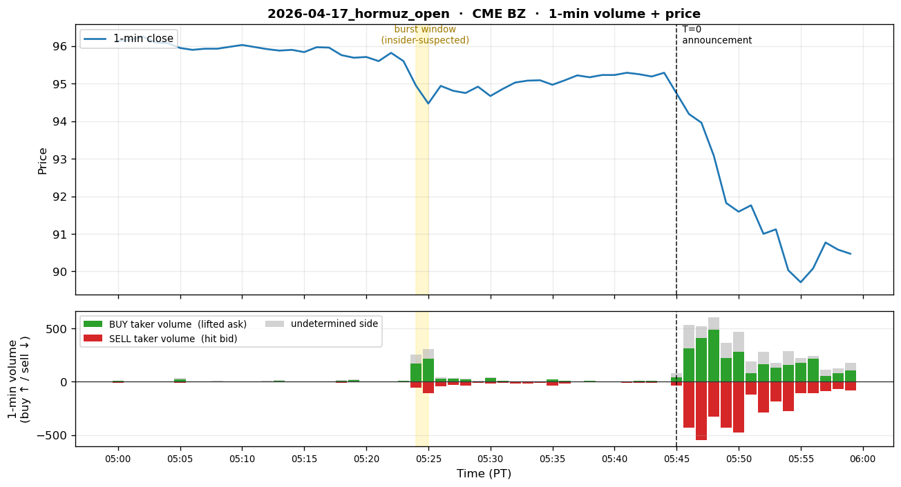

# 2026-04-17 — Iran FM Araghchi Announces Hormuz Strait Open

## 1. Event summary

| Field                | Value                                                                                  |
|----------------------|----------------------------------------------------------------------------------------|
| Announcement time    | **2026-04-17 5:45 AM PDT** (= 12:45 UTC) — Iran FM Araghchi X post                             |
| Market impact        | Brent -11%, WTI -12%, oil $100 → $89 / $83 (intraday). Burst itself: -1.24% in 2 min (§9 data). |
| INSIDER likelihood   | **Extremely high** — 3-time repeating pattern (2025-04-09, 2026-03-23, 2026-04-17), CFTC investigation, cumulative $2.2B |
| Pre-event window     | **T-21min (5:24 AM PDT) burst start → T-20min (5:25 AM PDT) burst peak**. PDF round-down "20 minutes before"; data-exact value 21 min. |

## 2. Pre-event suspicious activity

- **When (PT primary)** — T=0 = **4/17 5:45 AM PDT**:
  - **T-21min (5:24 AM PDT = 12:24 UTC)**: burst starts — CME BZ 209 trades /
    price 95.65→94.95 (-0.73%).
  - **T-20min (5:25 AM PDT)**: burst peak — CME BZ 268 trades / price
    94.95→94.47 (-0.51%). Total 2-min decline -1.24%.
  - PDF's "20 minutes before" is round-down — data-exact value is 21 min.
- **Platform**: **ICE Brent** (dominant venue) + CME Brent (BZ) crude oil futures.
  PDF's 7,990 lots is estimated ICE+CME combined; our §9 is CME only (~9% capture).
- **Direction (price-derived, confirmed)**: **Brent oil short** (betting on decline). Verified by data:
  CME BZ burst 2-min price -1.24% (intraday cumulative -11%). _Note: the §9
  taker-aggressor label ("LONG buy-side") is misleading — the main Brent venue
  is ICE, so the CME slice captures only retail buyer flow, and the insider short's actual flow
  is on ICE. The true direction is judged by the price movement._
- **Position**: 7,990 lots, ~$760M notional (~1 trillion KRW). Single 1-min bar
  (PDF 5:24-5:25 PDT, = §9's t=-21 ~ t=-20).
- **Profit**: Large — exact undisclosed. 11% drop = ~$83M (notional × 0.11) — tens of millions to
  hundreds of millions estimated.
- **Account pattern**: Aggressive taker (PDF claim), 1-min burst, one-way directional bet with no
  hedge. However, only buyer-side aggressors are visible in the CME slice, consistent with ICE being
  the main venue (see §9 caveat).
- **Repeating pattern**: **2025-04-09** (Liberation Day — Brent oil burst data-validated,
  T-16min 325 trades / +0.71 price spike; SPY call options the same day),
  **2026-03-23** (Iran strike pause), **2026-04-17** (this event) — same pattern across all 3.
  PDF row #7 (2026-04-21) is added as the 4th instance (4-time repetition) — see §8 table.
  Strong suspicion of the same actor.
- **Investigation**: Expanded CFTC investigation pending; CME Group asked to submit records.
  Cumulative $2.2B+.

## 3. Per-channel expected detector behavior

### 3.1 Channel 1 — Polymarket

- **State**: SILENT.
- **Reason**: A Hormuz-strait-specific market on Polymarket is unlikely. Oil-price prediction markets
  also typically have low liquidity.
- **Expected detector firing**: None.
- **Conclusion**: **NORMAL**.

### 3.2 Channel 2 — Hyperliquid

- **State**: SILENT.
- **Reason**: Unrelated to the crypto market.
- **Expected detector firing**: None.
- **Conclusion**: **NORMAL**.

### 3.3 Channel 3 — CME (PRIMARY)

- **State**: **EMERGENCY target**. This is the second justification use case for the P9.3 CME
  channel (the largest size in the 3-time repeating pattern). Size is so big and all entered within
  1 minute that if our detector can't catch this, no other case can be caught either.
- **Detector simulation (T-21min ~ T+0)** — data-validated burst window:
  - **`vol_z_v1` (CME BZ — Brent 1-min volume z-score)**:
    - T-30min ~ T-22min (5:15–5:23 PDT): NORMAL (5–26 trades/min, z ~0)
    - **T-21min (5:24 PDT)**: burst start — **209 trades** vs baseline ~13 = z ≈ **15**.
      **Directly EMERGENCY**.
    - **T-20min (5:25 PDT)**: burst peak — **268 trades** = z ≈ **20**.
    - T-19min ~ T+0: trade ends, sticky window holds EMERGENCY.
    - **Caveat**: CME only; only ~9% of PDF's "7,990 lots in 1 min" captured.
      Including ICE Brent, burst size is ~11x (P10.5 cross-exchange task).
  - **`vol_z_v1` (CL — WTI)**: If the same actor also shorted WTI, simultaneous
    burst. The user PDF only specifies Brent — verify same-time WTI 1-min
    volume in P10.2 (possibility of Brent/WTI spread arbitrage).
  - **`vol_z_v1` (ES — E-mini S&P)** — **verification needed**:
    - Hormuz open → oil sharp drop → benefits airline/transport names. Hedging flow possible in ES
      during pre-event window.
    - Verify ES 1-min volume in P10.2.
  - **`price_jump_v1`**: T-21min ~ T-20min has **-1.24% in 2 min** (CME BZ-based,
    data-validated). The full -11% jump is after T+0 (Araghchi X post).
  - **`tradingview_webhook`**: A Brent burst triggers a TV alert → enricher sends enrichment
    quickly.
- **Target tier timeline** (PT primary):
  - T-30min ~ T-22min (5:15–5:23 PDT): NORMAL
  - **T-21min (5:24 PDT)**: **EMERGENCY** (CME BZ 209 trades z ≈ 15 + price -0.73% simultaneously
    — size is large enough for direct EMERGENCY on the first 1-min bar)
  - **T-20min (5:25 PDT)**: EMERGENCY (burst peak, 268 trades z ≈ 20)
  - T-19min ~ T-1min (5:26–5:44 PDT): EMERGENCY held (sticky window)
  - **T+0 (5:45 PDT, Araghchi X post → -11% jump)**: EMERGENCY
  - T+30min (6:15 PDT): RISK_OFF (de-escalation)
- **Conclusion**: CME is the clear primary. **EMERGENCY possible at the first 1-min bar 21 min
  before announcement (5:24 PDT)**. Strong signal from Brent alone — if CL/ES also burst, even more
  certain. (Note: estimate based on CME alone; including ICE Brent, z is even more extreme.)

### 3.4 Channel 4 — X (Twitter)

- **State**: Post-fact forensic. + Caveat: the announcement source itself is an X post (Araghchi)!
- **2 X-path separation**:
  1. **Announcement-side**: If Araghchi's X post (5:45 AM PDT) is on our X channel
     watchlist as an official Iran government account, we poll and fetch it. But our watchlist is
     (PolymarketHistory, Lookonchain, unusual_whales, Bubblemaps, WhaleAlert, mlmabc) — Araghchi
     absent. → Our X channel **cannot capture announcement-side**.
  2. **Forensic-side**: unusual_whales / WhaleAlert post-fact reports "Brent 7,990
     lots short 1-min burst, 3-time repeating pattern." We can catch this.
- **Expected detector firing (forensic-side)**:
  - `Stage1Filter`: ticker_match (`Brent`, `BZ`, `oil`), case_match
    (`brent`, `cme`, `1 min burst`), common_match (`short`, `coordinated`),
    regex_match (`usd_amount`). Score ~1.0 → Stage1 PASS.
  - `LLMClassifier`: matched_case = `2026.03.23_cme_oil_iran_pause` (or
    similar), confidence ~0.80, NEUTRAL/SELL, is_pre_event=False (post-fact). Tier =
    **WATCH**.
- **Conclusion**: Post-fact WATCH only. Pre-event capture impossible.

> **Important P10 insight**: If we add Iran government accounts like Araghchi to our
> watchlist, future events become announcement-side X-capturable
> (provided the LLM correctly reasons about market impact of Iran political statements). Review
> watchlist extension in P10.5.

## 4. Expected system_state timeline

T=0 = **2026-04-17 05:45 AM PDT** (= 12:45 UTC).

```
T-30min (5:15 PDT) | NORMAL                                                         per_channel: pm=N, hl=N, cme=N, x=N
T-22min (5:23 PDT) | NORMAL  (baseline 13 trades — just before burst)                       per_channel: pm=N, hl=N, cme=N, x=N
T-21min (5:24 PDT) | EMERGENCY (CME BZ 209 trades z≈15 + price -0.73%, burst start)    per_channel: pm=N, hl=N, cme=E, x=N
T-20min (5:25 PDT) | EMERGENCY (burst peak: 268 trades z≈20, price -0.51%)            per_channel: pm=N, hl=N, cme=E, x=N
T-15min (5:30 PDT) | EMERGENCY (sticky window)                                       per_channel: pm=N, hl=N, cme=E, x=N
T- 5min (5:40 PDT) | EMERGENCY                                                       per_channel: pm=N, hl=N, cme=E, x=N
T+ 0   (5:45 PDT)  | EMERGENCY (Araghchi X post → Brent intraday -11%)               per_channel: pm=N, hl=N, cme=E, x=N
T+30min (6:15 PDT) | RISK_OFF                                                        per_channel: pm=N, hl=N, cme=R, x=W (post-fact coverage)
T+ 1h  (6:45 PDT)  | WATCH                                                           per_channel: pm=N, hl=N, cme=W, x=W
```

## 5. P10 detection target

- **Detection latency target (median ≤ 60s)**:
  - **5:24 AM PDT (T-21min) 1-min bar close (= 5:25 PDT)** → vol_z computation
    → detector EMERGENCY fires → ChannelSignal → fusion → alert ≤ 60s.
- **Warning time**: **~20 min** (T-21 burst-start detection → 5:45 PDT announcement).
- **False-positive risk**:
  - Brent 1-min volume z >> 8 is a very rare event. FP essentially zero.
  - However, vol bursts can occur during known events like OPEC meetings → macro event
    calendar mask needed.

## 6. Sources

- User PDF row #6.
- News reference: 2026-04-17 12:45 UTC Iran FM Araghchi X post (Hormuz open).
  Status ID lookup needed.
- CFTC investigation coverage — $2.2B+ cumulative suspicious oil-futures trades.
- Coverage of CME Group records submission request.

## 7. P10.2 Data Collection Checklist

- [ ] **CME Brent (BZ) 1-min OHLCV** — Databento, 2026-04-17 12:00–13:30 UTC
- [ ] **CME WTI (CL) 1-min OHLCV** — same window. Possibility of Brent/WTI spread arb.
- [ ] **CME ES 1-min OHLCV** — same window. Verify airline/transport benefits hedging flow
      pre-event.
- [ ] **ICE Brent 1-min volume** — A large portion of Brent trades on ICE, so cross-exchange
      aggregation needed (P10.5 enhancement).
- [ ] **3-time repeating pattern verification** — **2025-04-09 (Liberation Day, search window 04-04 ~ 04-09)**,
      2026-03-23, 2026-04-17 Brent 1-min burst patterns compared. Cross-link Event #1 file
      (`2025-04-09_liberation_day.md`) Brent oil verification results.
- [ ] **Araghchi X post status ID** — exact timestamp + text
- [ ] **CFTC report** — investigation progress related to the Hormuz event
- [ ] **Watchlist extension review** — whether to add Iran government accounts (Araghchi, Khamenei, etc.)
      to the X watchlist

## 8. Cross-event analysis (4-time repetition — PDF row #6's 3 events + PDF row #7's 4/21 added)

| Event date         | Asset            | Burst window        | Volume (data-validated)       | Notional                 | Pattern               |
|--------------------|------------------|---------------------|-------------------------------|--------------------------|-----------------------|
| **2025-04-09**     | Brent + SPY      | T-16min (3:48 PT)   | CME BZ 325 trades / +0.71 spike (1 min) | SPY $2.14M → +$18.86M    | Liberation Day — Brent burst data-validated (Event #1 §9) + SPY call options |
| **2026-03-23**     | WTI/Brent + ES   | T-15 ~ T-14 (3:49–3:50 PT) | CL 1,168 trades / -0.61% (2 min) + ES 2,091 trades / +0.23% | $580M (oil) + $1.5B (S&P)  | Iran strike pause — Oil short + S&P long dual-fire (Event #5 §9) |
| **2026-04-17**     | Brent (ICE+CME)  | T-21 ~ T-20 (5:24–5:25 PDT) | CME BZ 268 trades / -1.24% (2 min); PDF 7,990 lots ICE+CME | ~$760M                   | Hormuz open — Brent short (this event)            |
| **2026-04-21**     | Brent (ICE+CME)  | T-16 ~ T-14 (12:54–12:56 PDT) | CME BZ + ICE Brent 4,260 lots / ~$430M total (PDF row #7) | ~$430M                   | Trump "Iran fractured" — Brent short post-settlement |

> **2025-04-09 (Liberation Day)**: data-validated — clear burst in Event #1 §9's CME BZ
> T-16min (60.59 → 61.30, 325 trades vs baseline ~10-20).
> ES also bursts simultaneously in the same 1-min bar → dual-instrument insider sample.

> **PDF inconsistency note**: PDF row #6 footer specifies a 3-event pattern (4/9, 3/23, 4/17),
> and PDF row #7 footer specifies a 4-event pattern (3/23, **4/7**, 4/17, 4/21) —
> 4/7 is unconfirmed (see Event #1 §8 OCR/typo hypothesis). This table adopts row #6 framing +
> 4/21 forward-extension.

**P10 cross-event detector candidate**: Same time of day (early AM PT or noontime),
same asset class (Brent oil futures), 1–2 min bursts, no-hedge one-way pattern
**repeating 4 times** — a very strong actor-identification signal. Our v1 spec lacks
a cross-event correlation detector → P10.5 enhancement candidate (especially tracking
the same trader's wallet/account fingerprint).

<!-- QUANT_SECTION_BEGIN — auto-generated by scripts/generate_historical_event_data.py -->
## 9. Quantitative replay data

_Official announcement: 2026-04-17 05:45 PT (= 12:45 UTC)._

_Per-section `t` is measured from the **section's own** T=0._  
_• Polymarket: T=0 is either the auto-detected decisive burst minute, or — when manually overridden — the start of the **insider accumulation window** (wallet-funding/wallet-splitting phase that precedes the public announcement)._  
_• CME / Hyperliquid: T=0 is the official announcement._  
_Burst (insider-suspected) rows are bold._  
_Volume columns: **buy** = taker lifted ask (long pressure), **sell** = taker hit bid (short pressure), **net** = buy − sell. Plots show buy volume above the zero line (green) and sell volume below (red), so a downward-dominant burst = short-pressure burst._

> ⚠ **4/17 Hormuz event — CME-only slice + direction caveat**:
> 1. **Venue coverage**: PDF's 7,990 lots is the estimated **ICE + CME** combined. Brent's
>    dominant venue is ICE, so our Databento CME BZ slice captures only ~9%
>    (2-min burst aggregate 726 contracts vs PDF 7,990).
> 2. **Direction**: PDF specifies Brent **SHORT** (price -11% intraday, burst 2 min
>    -1.24%). However the footer's "→ LONG (buy-side)" auto-label is on a **taker-aggressor**
>    basis, so if the insider entered via limit orders on ICE, only retail
>    buyer flow shows on CME. **Judge the true direction by the price movement**
>    (CME BZ 95.65 → 94.47 in 2 min).

### CME BZ



**1-min OHLCV** (5 bars before burst → burst → 3 bars after):

| t (min) | open | high | low | close | buy | sell | net | trades |
|---:|---:|---:|---:|---:|---:|---:|---:|---:|
| -26 | 95.70 | 95.71 | 95.66 | 95.69 | 18 | 4 | +14 | 26 |
| -25 | 95.72 | 95.75 | 95.71 | 95.71 | 5 | 5 | +0 | 9 |
| -24 | 95.63 | 95.65 | 95.60 | 95.60 | 5 | 6 | -1 | 11 |
| -23 | 95.79 | 95.82 | 95.79 | 95.82 | 2 | 3 | -1 | 5 |
| -22 | 95.83 | 95.83 | 95.59 | 95.60 | 8 | 4 | +4 | 13 |
| **-21** | **95.65** | **95.65** | **94.89** | **94.95** | **170** | **56** | **+114** | **209** |
| -20 | 94.95 | 95.03 | 94.28 | 94.47 | 218 | 106 | +112 | 268 |
| -19 | 94.49 | 94.95 | 94.49 | 94.94 | 26 | 40 | -14 | 74 |
| -18 | 94.95 | 95.15 | 94.76 | 94.81 | 26 | 32 | -6 | 62 |
| -17 | 94.83 | 94.84 | 94.65 | 94.75 | 24 | 34 | -10 | 40 |


**2-min burst aggregate** (max volume bar in burst window): `726 contracts` (CME only, ~9% of PDF 7,990 lots) — **388 buy / 162 sell** (taker-aggressor) — **price-derived direction: SHORT** (95.65 → 94.47 in 2 min = **-1.24%**, Brent sharp drop — matches PDF row #6)


**5-min burst aggregate** (max volume bar in burst window): `648 contracts` (CME only) — **300 buy / 224 sell** (taker-aggressor) — **price-derived direction: SHORT** (95.65 → 94.75 in 5 min = -0.94%, short-term Brent decline held)


<!-- QUANT_SECTION_END -->
