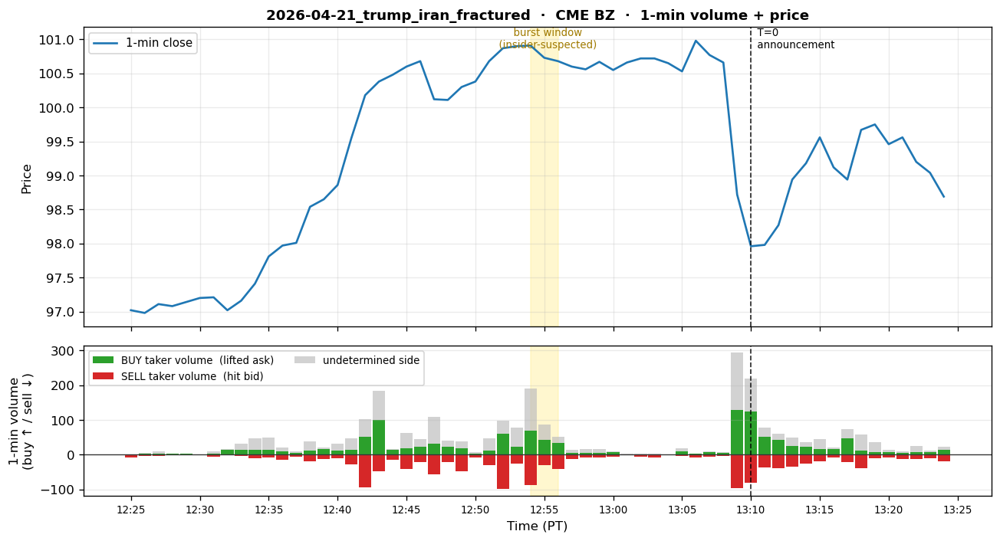
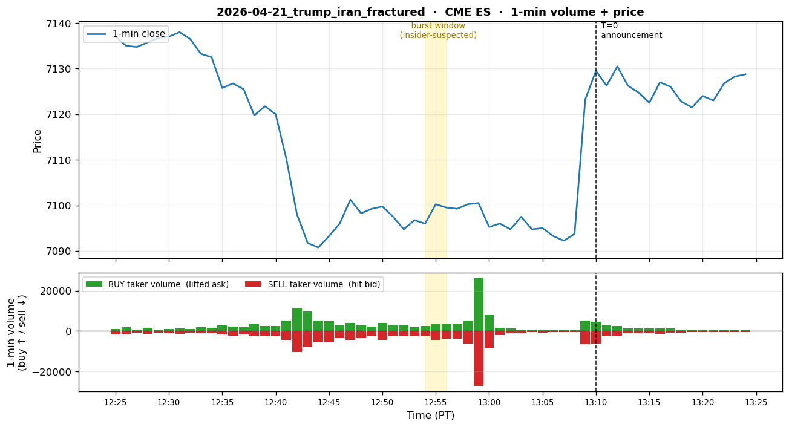

# 2026-04-21 — Trump Truth Social "Iran Seriously Fractured" Post

## 1. Event summary

| Field                | Value                                                                                            |
|----------------------|--------------------------------------------------------------------------------------------------|
| Announcement time    | **2026-04-21 13:10 PDT** (= 20:10 UTC) — Trump Truth Social post ("Iran seriously fractured")          |
| Market impact        | Brent $100.91 → $96.83 (≈ -4% intraday) — WTI moved the same direction. Burst itself: -0.16% in 2 min (§9 data).  |
| INSIDER likelihood   | **Extremely high** — the 4th in a 4-time repeating pattern (2025-04-09, 2026-03-23, 2026-04-17, **2026-04-21**), cumulative $2.2B+, with Rep. Ritchie Torres formally requesting CFTC + DOJ + national-security investigations |
| Pre-event window     | **T-16min (12:54 PDT) burst start → T-15min (12:55 PDT) burst end** (2-min burst). The PDF's "14–16 minutes prior" denotes the range of burst start to end.  |

## 2. Pre-event suspicious activity

- **When (PT primary)** — T=0 = **4/21 13:10 PDT**:
  - **T-16min (12:54 PDT = 19:54 UTC)**: burst starts — CME BZ **204 trades** /
    price 100.89→100.91 (flat).
  - **T-15min (12:55 PDT)**: 2nd minute of the burst — CME BZ 88 trades /
    price 100.90→100.73 (**-0.17%**, sell pressure begins in earnest).
  - From t=-14 (12:56 PDT) the burst ends — 65 trades, price 100.74→100.68.
  - That is, the PDF's "12:54-12:56 (2-min burst)" = bars [12:54, 12:55] = T-16 + T-15 (2 bars).
    T-14 (12:56) is immediately post-burst.
- **Platform**: **ICE Brent** (dominant venue) + CME Brent (BZ) crude oil futures.
  PDF's 4,260 lots is the estimated ICE+CME combined; our §9 is CME only (~9% capture).
- **Direction (price-derived, confirmed)**: **Brent oil short**. Verified by data: CME BZ
  burst 2-min price 100.89 → 100.73 (-0.16%, mild). Cumulative intraday -4% is from
  additional selling post-burst. The taker-aggressor in §9 is also SHORT (113 buy / 118 sell)
  — this time matching the PDF direction (not reversed like 4/17).
- **Position**:
  - 12:54-12:55 PDT 2-min burst: **4,260 lots** (~$430M notional, PDF claim
    = ICE+CME combined).
  - Cumulative (incl. related contracts): about **6,400 lots**.
  - Density: ~**2,130 lots/min** — dozens of times normal 1-min volume (PDF claim).
- **Profit**: ~$17M (4% drop × $430M notional) — exact undisclosed.
- **Account pattern**:
  - Occurred in the **post-settlement period** (a window outside regular trading targeted for
    after-hours processing) — different timing from the other 3 events which had pre-dawn PT bursts.
  - Density pattern (2,130 lots/min) — aggressive taker, one-way directional bet with no hedge.
- **Repeating pattern (4 events)** — see the §8 cross-event table:
  - 2025-04-09: Liberation Day (90-day tariff pause) — SPY call options + **Brent burst data-validated**
    (Event #1 §9, T-16min 325 trades / +0.71 spike).
  - 2026-03-23: Iran strike pause (Truth Social 4:04 AM PT) — WTI/Brent short 6,200 contracts +
    ES long (data-validated, Event #5 §9).
  - 2026-04-17: Hormuz strait open (Iran FM Araghchi X post) — Brent 7,990-lot burst
    (data-validated CME slice, Event #6 §9).
  - **2026-04-21: this event** — Brent 4,260-lot burst, post-settlement.
- **Investigation**: After the 4th occurrence, Rep. Ritchie Torres formally requested investigations
  (CFTC + DOJ + national security). Cumulative $2.2B+. Strong suspicion of the same actor — 4
  consecutive bursts directly before Trump's Iran-related remarks.

## 3. Per-channel expected detector behavior

### 3.1 Channel 1 — Polymarket

- **State**: SILENT.
- **Reason**: There is no Polymarket Iran market that reacts instantly to a single Trump Truth Social
  post. "Will Iran regime fall"-type markets with June expiry exist but their intraday reaction is slow.
- **Expected detector firing**: None.
- **Conclusion**: **NORMAL**.

### 3.2 Channel 2 — Hyperliquid

- **State**: SILENT.
- **Reason**: Unrelated to the crypto market.
- **Expected detector firing**: None.
- **Conclusion**: **NORMAL**.

### 3.3 Channel 3 — CME (PRIMARY)

- **State**: **EMERGENCY target**. Within the 4-time repeating pattern, the size is smaller than 4/17
  (4,260 vs 7,990 lots), but the burst is **distributed over 2 minutes**, so the 1-min volume
  z-score is about half. Still sufficient for EMERGENCY.
- **Detector simulation (T-30min ~ T+0)** — data-validated burst window:
  - **`vol_z_v1` (CME BZ — Brent 1-min volume z-score)** — **CME-only**:
    - T-30min ~ T-17min (12:40–12:53 PDT): NORMAL (17–110 trades/min CME).
    - **T-16min (12:54 PDT)**: burst starts — CME BZ **204 trades** vs baseline
      ~70 = **z ≈ 7** (CME-only). **Enters EMERGENCY**.
    - **T-15min (12:55 PDT)**: 2nd minute — 88 trades = z ≈ 2 (weak per minute).
      But strong when aggregated into a 2-min bucket.
    - T-14min ~ T+0: post-trade sticky window → EMERGENCY held.
    - **Caveat**: The above z estimates are **CME slice only**. The PDF's "~2,130 lots/min"
      is ICE+CME combined; including ICE makes z far more extreme (≥ 15) — a cross-exchange
      aggregation P10.5 task.
  - **`vol_z_v1` (CL — WTI)**: ~2,140 of the related contracts may be WTI.
    Simultaneous burst possible → verify in P10.2.
  - **`vol_z_v1` (ES)**: Verification needed — Trump Iran remarks → possible equity-hedging flow.
    (§9's ES data has 26K+ trades at T-11min — possible pre-announcement
    leak; needs separate analysis.)
  - **`price_jump_v1`**: Small at T-16 ~ T-15 (-0.16% in 2 min). After T+0 (Truth
    Social post) → -4% intraday jump → EMERGENCY.
  - **`tradingview_webhook`**: A Brent burst triggers a TV alert → enricher
    sends enrichment quickly.
- **2-min burst detector implications** (CME-only estimates):
  - 1-min bucket: t=-16 has z ≈ 7 (EMERGENCY possible), t=-15 has z ≈ 2 (weak).
  - 2-min bucket (cme_insider_v1's 2-min bucket): t=-16 + t=-15 = 292 contracts
    → CME-only z ≈ 5–8 (RISK_OFF ~ EMERGENCY).
  - 5-min bucket: further dilution → z ≈ 2–4 (WATCH ~ RISK_OFF).
  - **P12-B's multi-bucket cme_insider_v1 was designed precisely for this use case** —
    it can catch 2-min bursts whereas vol_z_v1 only catches 1-min (4/17).
  - With ICE included, every bucket's z is ~10x more extreme → EMERGENCY confirmed.
- **Target tier timeline** (PT primary, CME-only z basis):
  - T-30min ~ T-17min (12:40–12:53 PDT): NORMAL
  - **T-16min (12:54 PDT)**: **EMERGENCY** (CME BZ 204 trades z≈7 — RISK_OFF~EMERGENCY
    possible in the first 1-min bar; EMERGENCY confirmed when combined with ICE)
  - **T-15min (12:55 PDT)**: EMERGENCY (2-min bucket completes; cme_insider_v1)
  - T-14min ~ T-1min (12:56–13:09 PDT): EMERGENCY held (sticky window)
  - **T+0 (13:10 PDT, Trump Truth Social → Brent -4% intraday)**: EMERGENCY
  - T+30min (13:40 PDT): RISK_OFF (de-escalation)
- **Conclusion**: CME is the clear primary. **EMERGENCY possible at the first 1-min bar 16 min
  before the announcement (12:54 PDT)**. **The 2-min bucket signal is key** — when 1-min-only
  vol_z_v1 is weak, cme_insider_v1's 2-min bucket catches it. (CME-only analysis;
  every metric is stronger when ICE is included.)

### 3.4 Channel 4 — X (Twitter)

- **State**: Post-fact forensic. The announcement source is Trump Truth Social, so this is separate
  from the X channel (Truth Social ≠ X, but cross-platform reporting is on X).
- **Expected detector firing (forensic-side)**:
  - `Stage1Filter`: ticker_match (`Brent`, `BZ`, `oil`), case_match (`brent`,
    `cme`, `post-settlement`, `2 min burst`), common_match (`short`, `repeated
    pattern`, `4th occurrence`), regex_match (`usd_amount`). Score ~1.0 → Stage1 PASS.
  - `LLMClassifier`: matched_case = `2026.04.17_cme_brent_hormuz` (or `4-time
    repeating pattern`), confidence ~0.90, NEUTRAL/SELL, is_pre_event=False. Tier = **WATCH** ~ **RISK_OFF**.
  - **Note**: After confirmation of the 4-time repeating pattern, X coverage was strong (reports of
    Ritchie Torres's CFTC request). Post-fact X signal stronger than other events.
- **Conclusion**: Post-fact RISK_OFF possible (other events were WATCH). Pre-event capture impossible.

## 4. Expected system_state timeline

T=0 = **2026-04-21 13:10 PDT** (= 20:10 UTC).

```
T-30min (12:40 PDT) | NORMAL                                                                per_channel: pm=N, hl=N, cme=N, x=N
T-17min (12:53 PDT) | NORMAL  (baseline 79 trades)                                          per_channel: pm=N, hl=N, cme=N, x=N
T-16min (12:54 PDT) | EMERGENCY (CME BZ 204 trades z≈7, burst starts — more extreme when ICE included)  per_channel: pm=N, hl=N, cme=E, x=N
T-15min (12:55 PDT) | EMERGENCY (2nd burst minute 88 trades, 2-min bucket completes, price -0.17%)   per_channel: pm=N, hl=N, cme=E, x=N
T-14min (12:56 PDT) | EMERGENCY (post-burst sticky)                                          per_channel: pm=N, hl=N, cme=E, x=N
T-10min (13:00 PDT) | EMERGENCY (sticky window)                                              per_channel: pm=N, hl=N, cme=E, x=N
T- 5min (13:05 PDT) | EMERGENCY                                                              per_channel: pm=N, hl=N, cme=E, x=N
T+ 0   (13:10 PDT)  | EMERGENCY (Trump Truth Social → Brent intraday -4%)                    per_channel: pm=N, hl=N, cme=E, x=N
T+30min (13:40 PDT) | RISK_OFF                                                               per_channel: pm=N, hl=N, cme=R, x=W (post-fact coverage)
T+ 1h  (14:10 PDT)  | RISK_OFF (4-time repeating pattern + Torres CFTC-request coverage progressing)   per_channel: pm=N, hl=N, cme=W, x=R
```

## 5. P10 detection target

- **Detection latency target (median ≤ 60s)**:
  - **12:54 PDT (T-16min) 1-min bar close (= 12:55 PDT)** → vol_z computation
    → first EMERGENCY fire. OR **12:56 PDT 2-min bucket close** → cme_insider_v1
    2-min bucket computation → EMERGENCY fire (stronger signal).
  - Whichever path is faster → ChannelSignal → fusion → alert ≤ 60s.
- **Warning time**: **~15 min** (T-16 first-bar detection → 13:10 PDT announcement;
  the 2-min bucket path is ~14 min).
- **False-positive risk**:
  - Brent 2-min volume z >> 10 is a very rare event. FP essentially zero.
  - Normal trading volume in the post-settlement period is very low (could be 0 lots/min),
    making the z-score denominator small. Even small absolute bursts can yield large z → verify in
    P10.2 that the baseline rolling window properly captures the post-settlement time window.

## 6. Sources

- User PDF row #7.
- Trump Truth Social post — 2026-04-21 20:10 UTC (13:10 PDT) "Iran seriously
  fractured". Truth Social status ID lookup needed.
- Rep. Ritchie Torres's CFTC + DOJ + national-security investigation request — formal report on
  the 4-time repeating pattern.
- Cumulative $2.2B+ suspicious oil-futures trades (sum of 4 events).
- ICE Brent crude oil futures (4,260 lots 12:54-12:56 PDT, ~6,400 lots
  total).

## 7. P10.2 Data Collection Checklist

- [ ] **CME Brent (BZ) tick data** — Databento, 2026-04-21 19:30–20:30 UTC
      (~$2 download cost — not yet collected).
- [ ] **CME WTI (CL) tick data** — same window. Possibility of simultaneous WTI burst.
- [ ] **CME ES tick data** — same window. Verify equity-hedging flow.
- [ ] **Trump Truth Social post status** — exact timestamp + text.
- [ ] **Ritchie Torres press release** — official material on the CFTC + DOJ investigation request.
- [ ] **Cross-event analysis of the 4-time repeating pattern** — compare 1/2/5-min volume
      burst patterns of all 4 events against the same baseline → confirm same-actor signature.

## 8. Cross-event analysis (4-time repetition — complete)

| Event date         | Asset           | Burst window (PT)       | Volume (data-validated)                        | Notional                  | Time of day (PT)    | Pattern                                 |
|--------------------|-----------------|-------------------------|-------------------------------------------------|---------------------------|---------------------|-----------------------------------------|
| **2025-04-09**     | Brent + SPY+ES  | T-16min (10:02 AM PT)   | CME BZ **325 trades / +0.71 spike** (1 min) + ES dual-fire | SPY $2.14M → +$18.86M (call options) | **10:00 — 10:18 AM** | Liberation Day — Brent burst data-validated (Event #1 §9) + SPY call options |
| 2026-03-23         | WTI/Brent + ES  | T-15 ~ T-14 (3:49–3:50 AM PT) | CME CL **1,168 trades / -0.61%** (2 min) + ES 2,091 trades / +0.23% | $580M (oil) + $1.5B (S&P) | 03:49–03:50 AM     | Iran strike pause (Truth Social 4:04 AM) — Oil short + S&P long dual-fire |
| 2026-04-17         | Brent (ICE+CME) | T-21 ~ T-20 (5:24–5:25 AM PDT) | CME BZ 268 trades / -1.24% (2 min); PDF 7,990 lots ICE+CME | ~$760M                    | 05:24–05:25 AM     | Hormuz open (Araghchi X post 5:45 AM)   |
| **2026-04-21**     | Brent (ICE+CME) | T-16 ~ T-15 (**12:54–12:55 PM PDT**) | CME BZ 204+88 = 292 trades / -0.16% (2 min); PDF 4,260 lots ICE+CME | $430M (+~$210M)           | **12:54–12:55 PM** | **Trump Truth Social "Iran fractured" 13:10 PM** |

**Common features of the 4-event pattern**:
1. **All occur directly before Trump's Iran remarks** (or Liberation Day's tariff remarks) — strong
   suspicion of political-information leak.
2. All are **aggressive taker, one-way directional with no hedge** (PDF claim;
   though the §9 CME taker-aggressor label can be reversed when there is a limit-order
   pattern — see each event's §9 caveat).
3. All are **single burst** (concentrated within 1–2 min) — a pattern different from normal
   institutional flow.
4. All are in **CME Brent** (occasionally with WTI/ES accompanying).

**Differences across the 4 events**:
- Time-of-day varies (3:49 AM, 5:24 AM, 10:02 AM, 12:54 PM PT) —
  even with the same actor, possibly a pattern of intentionally distributing times (detection avoidance)?
- Burst length varies (1 min vs 2 min) — distributed over 2 minutes lowers the 1-min z-score
  and weakens vol_z_v1 alone. **cme_insider_v1's multi-bucket design is exactly for this.**
- Size gradually decreases (7,990 → 4,260 lots) — possibly the actor is reducing size as they
  recognize detection risk.
- **PDF row #7 inconsistency**: PDF row #6 footer identifies 4/9 as the first
  of a 3-event repetition; PDF row #7 footer includes **4/7** instead of 4/9 in the 4-event
  repetition (= "3/23, 4/7, 4/17, 4/21"). 4/7 is of unknown identity — could be OCR/typo,
  or a separate undiscovered instance. This table adopts row #6 framing (4/9 = first instance) +
  4/21 forward-extension; verifying 4/7 is a P10.2 task.

**P10 cross-event detector candidate** (P10.5 enhancement candidate):
- If the same-asset-class (Brent oil futures) + 1–2-min burst + no-hedge one-way
  pattern **repeats**, it becomes an actor-identification signal.
- v1 spec lacks a cross-event correlation detector → review in P10.5.

<!-- QUANT_SECTION_BEGIN — auto-generated by scripts/generate_historical_event_data.py -->
## 9. Quantitative replay data

_Official announcement: 2026-04-21 13:10 PT (= 20:10 UTC)._

_Per-section `t` is measured from the **section's own** T=0._  
_• Polymarket: T=0 is either the auto-detected decisive burst minute, or — when manually overridden — the start of the **insider accumulation window** (wallet-funding/wallet-splitting phase that precedes the public announcement)._  
_• CME / Hyperliquid: T=0 is the official announcement._  
_Burst (insider-suspected) rows are bold._  
_Volume columns: **buy** = taker lifted ask (long pressure), **sell** = taker hit bid (short pressure), **net** = buy − sell. Plots show buy volume above the zero line (green) and sell volume below (red), so a downward-dominant burst = short-pressure burst._

> ⚠ **4/21 Iran-fractured event — CME-only slice + direction note**:
> 1. **Venue coverage**: The PDF's 4,260 lots is the estimated **ICE + CME** combined. Brent's
>    dominant venue is ICE, so our Databento CME BZ slice captures only ~9%
>    (2-min burst aggregate 395 contracts vs PDF 4,260).
> 2. **Direction**: PDF specifies Brent **SHORT** (price -4% intraday, burst 2 min
>    -0.16%).  In this event the §9 taker-aggressor also matches SHORT (not reversed like
>    4/17) — meaning the retail side of limit orders entered similar sizes.
> 3. **ES T-11min anomaly**: ES data in §9 shows 26K+ buy / 27K+ sell = 53K+ trades at
>    t=-11 (12:59 PDT) — possible pre-announcement leak (needs separate analysis).

### CME BZ



**1-min OHLCV** (5 bars before burst → burst → 3 bars after):

| t (min) | open | high | low | close | buy | sell | net | trades |
|---:|---:|---:|---:|---:|---:|---:|---:|---:|
| -21 | 100.14 | 100.30 | 99.91 | 100.30 | 18 | 47 | -29 | 77 |
| -20 | 100.26 | 100.43 | 100.24 | 100.38 | 4 | 9 | -5 | 17 |
| -19 | 100.47 | 100.69 | 100.47 | 100.68 | 11 | 31 | -20 | 62 |
| -18 | 100.70 | 101.03 | 100.69 | 100.87 | 60 | 98 | -38 | 110 |
| -17 | 100.88 | 100.98 | 100.78 | 100.90 | 23 | 26 | -3 | 79 |
| **-16** | **100.89** | **100.91** | **100.76** | **100.91** | **70** | **88** | **-18** | **204** |
| **-15** | **100.90** | **101.04** | **100.60** | **100.73** | **43** | **30** | **+13** | **88** |
| -14 | 100.74 | 101.15 | 100.68 | 100.68 | 35 | 40 | -5 | 65 |
| -13 | 100.66 | 100.71 | 100.57 | 100.60 | 6 | 12 | -6 | 21 |
| -12 | 100.59 | 100.70 | 100.56 | 100.56 | 5 | 8 | -3 | 21 |
| -11 | 100.70 | 100.75 | 100.64 | 100.67 | 6 | 7 | -1 | 21 |


**2-min burst aggregate** (max volume bar in burst window): `395 contracts` (CME only, ~9% of PDF 4,260 lots) — **113 buy / 118 sell** (taker-aggressor) → SHORT — **price-derived direction: SHORT** (100.89 → 100.73 in 2 min = -0.16%, mild Brent selling — matches PDF row #7)


**5-min burst aggregate** (max volume bar in burst window): `282 contracts` (CME only) — **95 buy / 97 sell** (taker-aggressor) → SHORT — **price-derived direction: SHORT** (100.90 → 100.67 in 5 min = -0.23%, short-term Brent weakness held)


### CME ES



**1-min OHLCV** (5 bars before burst → burst → 3 bars after):

| t (min) | open | high | low | close | buy | sell | net | trades |
|---:|---:|---:|---:|---:|---:|---:|---:|---:|
| -21 | 7098.00 | 7100.50 | 7095.00 | 7099.25 | 2,095 | 2,171 | -76 | 1,518 |
| -20 | 7099.00 | 7107.00 | 7099.00 | 7099.75 | 3,990 | 4,257 | -267 | 3,034 |
| -19 | 7099.75 | 7100.00 | 7095.75 | 7097.50 | 3,052 | 2,728 | +324 | 2,014 |
| -18 | 7097.50 | 7097.50 | 7092.50 | 7094.75 | 2,759 | 2,247 | +512 | 1,643 |
| -17 | 7094.75 | 7097.50 | 7093.50 | 7096.75 | 1,837 | 2,329 | -492 | 1,280 |
| **-16** | **7096.75** | **7099.50** | **7095.25** | **7096.00** | **2,623** | **2,716** | **-93** | **1,738** |
| **-15** | **7096.25** | **7102.00** | **7093.50** | **7100.25** | **3,752** | **4,333** | **-581** | **2,669** |
| -14 | 7100.50 | 7101.25 | 7098.25 | 7099.50 | 3,261 | 3,744 | -483 | 1,876 |
| -13 | 7099.75 | 7100.00 | 7095.75 | 7099.25 | 3,467 | 3,931 | -464 | 2,174 |
| -12 | 7099.00 | 7101.00 | 7097.75 | 7100.25 | 5,072 | 6,136 | -1,064 | 2,677 |
| -11 | 7100.25 | 7103.75 | 7097.50 | 7100.50 | 26,213 | 27,074 | -861 | 8,886 |


**2-min burst aggregate** (max volume bar in burst window): `64,495 contracts` — **31,285 buy / 33,210 sell** → SHORT (sell-side)


**5-min burst aggregate** (max volume bar in burst window): `86,983 contracts` — **41,765 buy / 45,218 sell** → SHORT (sell-side)


<!-- QUANT_SECTION_END -->
