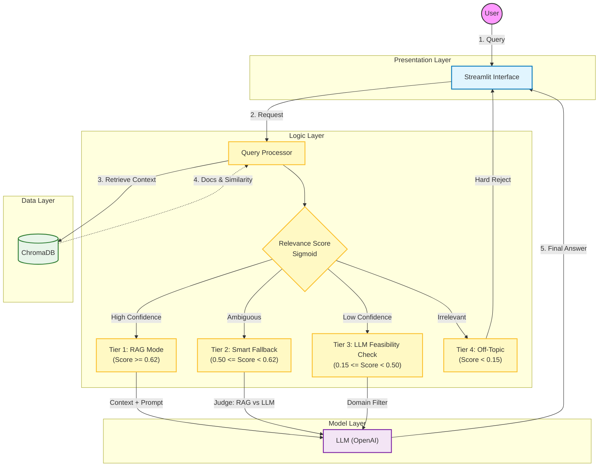
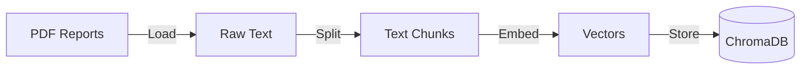

# System Architecture

This document provides a deep dive into the architecture of the **Trading Advisor**. The system is designed to be modular, scalable, and robust using a **4-Tier Conditional RAG** approach.

## 1. High-Level Architecture Diagram

The following diagram illustrates the end-to-end data flow, from user query to the final response, highlighting the decision-making process within the Logic Layer.

## 2. High-Level Components

The application consists of three main layers:

1.  **Presentation Layer (Streamlit)**: Handles user interaction and displays visualization.
2.  **Logic Layer (Advisor)**: The core brain that orchestrates the RAG pipeline, LLM calls, and decision logic.
3.  **Data Layer (Vector Store & Docs)**: Manages the ingestion, storage, and retrieval of unstructured financial data.

## 3. Data Pipeline (Ingestion)

Before the system can answer questions, documents must be processed. This is handled by `src/document_pipeline.py`.

1.  **Loading**: Reads `.pdf` and `.docx` files from the `data/` directory.
2.  **Splitting**: Breaks documents into chunks of **800 characters** (with 100 overlap) to fit into the LLM context window.
3.  **Embedding**: Converts text chunks into vector representations using `Finance2_embedding_small_en-V1.5`.
4.  **Indexing**: Stores vectors in **ChromaDB** for fast similarity search.

## 4. Query Processing Flow

When a user asks a question, the `ConditionalRAGAdvisor` (`src/advisor.py`) executes the following workflow:

### Step 1: Relevance Scoring
The system first retrieves the top-k relevant document chunks and calculates a **semantic similarity score**. This score is passed through a **Sigmoid function** to sharpen the distinction between relevant and irrelevant queries.

### Step 2: Decision Logic (The 4 Tiers)
Based on the score, one of four modes is selected:

| Tier | Condition | Action | Description |
| :--- | :--- | :--- | :--- |
| **1. RAG Mode** | `Score >= 0.62` | **Retrieve & Answer** | High confidence that documents contain the answer. |
| **2. Smart Fallback** | `0.50 <= Score < 0.62` | **Compare RAG vs LLM** | Documents might be weak. Generate both answers and let an "LLM Judge" pick the best one. |
| **3. LLM Feasibility Check** | `0.15 <= Score < 0.50` | **LLM Knowledge** | Question is likely general finance (not in docs). Ask LLM but verify it's finance-related. |
| **4. Off-Topic** | `Score < 0.15` | **Reject** | Question is clearly unrelated (e.g., "Who won the World Cup?"). |

### Step 3: Response Generation
*   **RAG Response**: Constructed using the retrieved context + System Prompt.
*   **LLM Response**: Constructed using the LLM's internal training data.

## 5. Component Details

### `src/advisor.py`
Contains the `ConditionalRAGAdvisor` class. It encapsulates the LangChain retrieval chains and the custom scoring logic.

### `src/config.py`
Centralizes all hyperparameters (thresholds, model names, chunk sizes) to ensure consistency across the application.

### `src/logging_utils.py`
Handles experiment tracking and cost estimation. It logs every query's latency, token usage, and decision mode for future optimization.
