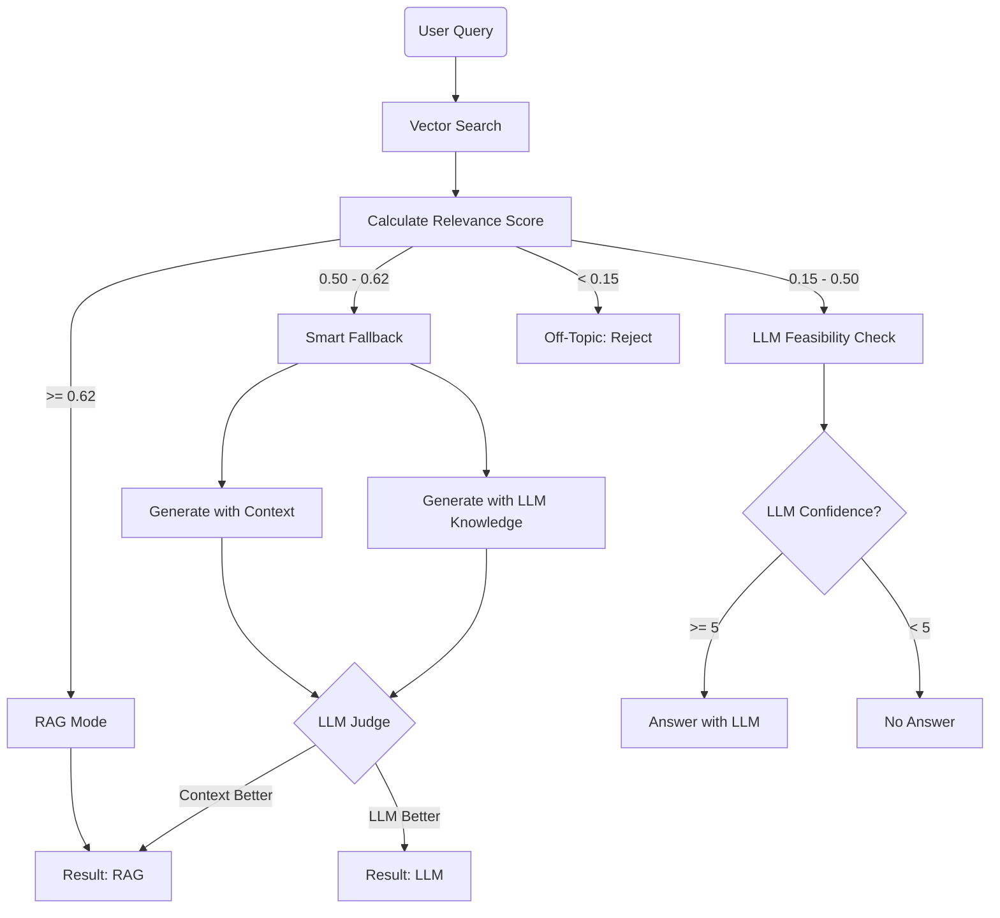

# Conditional RAG Logic

The core innovation of this project is the **Conditional RAG** mechanism. Unlike conventional RAG system that retrieve documents for every query, this system evaluates the *necessity* and *quality* of retrieval before generating an answer.

## The Problem with Conventional RAG

Conventional RAG systems fail in two common scenarios:
1.  **Irrelevant Retrieval**: When a user asks a general question (e.g., "What is a stock option?"), the system might try to force an answer from a specific PDF report about "Tesla's Q3 Earnings," leading to confusing results.
2.  **Off-Topic Hallucination**: When asked about non-finance topics (e.g., "How to bake a cake"), conventional RAG might retrieve semantically "closest" noise and try to answer.

## The Solution: 4-Tier Decision Engine

We implemented a **Relevance Score** based on cosine similarity, transformed by a Sigmoid function to create distinct confidence tiers.

### 1. The Scoring Function

```python
# Simplified logic from src/advisor.py
avg_similarity = mean(cosine_scores)
sigmoid_score = 1 / (1 + exp(-steepness * (avg_similarity - midpoint)))
```

This transformation pushes borderline scores towards 0 or 1, making the decision boundary clearer.

### 2. The Four Tiers

#### 🟢 Tier 1: RAG Mode (High Relevance)
*   **Threshold**: Score ≥ 0.62
*   **Scenario**: The user asks about specific data present in the documents.
*   **Action**: Retrieve context from ChromaDB and generate an answer strictly based on that context.

#### 🟢/🔵 Tier 2: Smart Fallback (Medium Relevance)
*   **Threshold**: 0.50 ≤ Score < 0.62
*   **Scenario**: The question is relevant to the domain but might not be fully covered by the uploaded documents.
*   **Action**: 
    1. Generate Answer A using Documents.
    2. Generate Answer B using LLM's general knowledge.
    3. Use an **"LLM Judge"** to score both answers on *Specificity*, *Relevance*, and *Factuality*.
    4. Return the winner:
       - 🟢 **RAG Answer** if documents provide better context
       - 🔵 **LLM Answer** if general knowledge is more comprehensive

#### 🟠/🔴 Tier 3: LLM Feasibility Check (Low Relevance)
*   **Threshold**: 0.15 ≤ Score < 0.50
*   **Scenario**: General financial questions not in the docs
*   **Action**: 
    1. Check if the topic is finance-related using a strict system prompt.
    2. Assess LLM confidence in the answer (0-10 scale).
    3. Decision based on confidence:
       - 🟠 **Answer** if confidence ≥ 5 (e.g., "Explain inflation")
       - 🔴 **"No Answer"** if confidence < 5 (e.g., "Predict AAPL price in 2030")

#### 🔴 Tier 4: Off-Topic (No Relevance)
*   **Threshold**: Score < 0.15
*   **Scenario**: Completely unrelated questions
*   **Action**: Immediately reject with a polite standard message.

## Logic Flowchart



